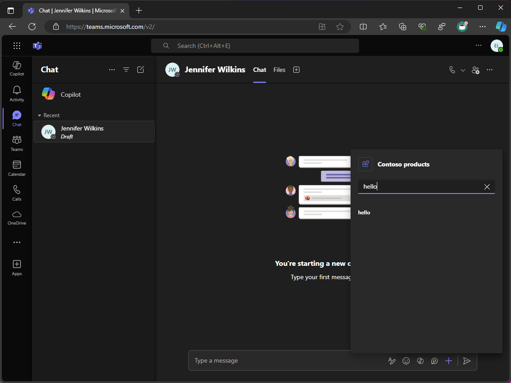

---
lab:
    title: 'Introduction'
    module: 'LAB 01: Connect Copilot for Microsoft 365 to your external data in real-time with message extension plugins built with .NET and Visual Studio'
---

# Introduction

Message extensions let users work with external systems from Microsoft Teams and Microsoft Outlook. Users can use message extensions to look up, change and share data from these systems in messages and emails as a rich formatted card.

Suppose you have a custom API that you use to access product information that is current and relevant to your organization. You want to search and share this information across Microsoft 365. You also want Copilot for Microsoft 365 to use this information in its answers.

In this module, you create a message extension. Your message extension uses a bot to communicate with Microsoft Teams, Microsoft Outlook, and Copilot for Microsoft 365.

It uses Microsoft Entra to authenticate users, which enables it to return data from the API on their behalf.

After the user authenticates, your message extension will get data from the API and return search results that can be embedded into messages and emails as a rich formatted card, and then shared.

It works with Copilot for Microsoft 365 as a plugin, enabling it to query the product data on behalf of the user and use the returned data in its answers.

By the end of this module, you're able to create message extensions written in C# (running on .NET). It can be used in Microsoft Teams, Microsoft Outlook, and Copilot for Microsoft 365. It can query data behind protected APIs and return the results as rich formatted cards.

## Prerequisites

- Basic knowledge of C#
- Basic knowledge of Bicep
- Basic knowledge of authentication
- Administrator access to a Microsoft 365 tenant
- Access to an Azure subscription
- Access to Copilot for Microsoft 365 is optional and required only to complete one exercise
- Visual Studio 2022 17.10+ with [Teams Toolkit](/microsoftteams/platform/toolkit/toolkit-v4/teams-toolkit-fundamentals-vs) (Microsoft Teams development tools component) installed
- [.NET 8.0](https://dotnet.microsoft.com/download/dotnet/8.0)
- [Dev Proxy 0.19.1+](https://aka.ms/devproxy)

## Learning objectives

At the end of this module, you should be able to:

- Understand what message extensions are and how to build them.
- Create a message extension.
- Understand how to authenticate users using single sign-on and call a custom API protected with Microsoft Entra authentication.
- Understand how to extend and optimize message extensions for use with Copilot for Microsoft 365.

When you're ready to begin, [continue to the first exercise...](./2-exercise-create-a-message-extension.md)
