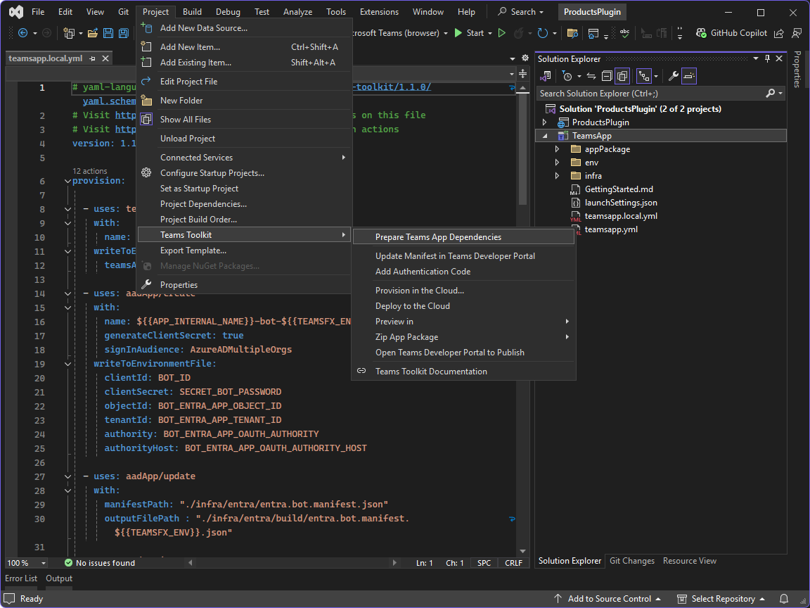

---
lab:
    title: 'Exercise 1 - Create a message extension'
    module: 'LAB 03: Connect Copilot for Microsoft 365 to your external data in real-time with message extension plugins built with .NET and Visual Studio'
---

# Exercise 1 - Create a message extension

In this exercise, you create a message extension solution. You use Teams Toolkit in Visual Studio to create the required resources, then start a debug session and test in Microsoft Teams.


## Task 1 - Create a new project with Teams Toolkit for Visual Studio

Start by creating a new Microsoft Teams app project configured with a message extension that contains a search command. While you could create a project using a Teams Toolkit for Visual Studio project template, there are changes required to be made to the scaffolded project to be able to complete this module. Instead, you use a custom project template that is available as a NuGet package. The benefit of using a custom template is that it creates a solution with the necessary files and dependencies, saving you time.

1. Open a new PowerShell session as Administrator.

1. Start with installing the template package from NuGet by running:

    ```pwsh
    dotnet new install M365Advocacy.Teams.Templates
    ```

1. Create a new project by running:

    ```pwsh
    dotnet new teams-msgext-search --name "ProductsPlugin" `
      --internal-name "msgext-products" `
      --display-name "Contoso products" `
      --short-description "Product look up tool." `
      --full-description "Get real-time product information and share them in a conversation." `
      --command-id "Search" `
      --command-description "Find products by name" `
      --command-title "Products" `
      --parameter-name "ProductName" `
      --parameter-title "Product name" `
      --parameter-description "The name of the product as a keyword" `
      --allow-scripts Yes
    ```

1. Wait for the project to be created.

1. Change to the project directory by running `cd ProductsPlugin`.

1. Open the solution in Visual Studio by running `.\ProductsPlugin.sln`.

## Create a Dev tunnel

When the user interacts with your message extension, the Bot service sends requests to the web service. During development, your web service runs locally on your machine. To allow the Bot service to reach your web service, you need to expose it beyond your machine using a Dev tunnel.


Continuing in Visual Studio:

1. On the toolbar, select the drop-down next to **Start** button, expand the **Dev Tunnels (no active tunnel)** menu and select **Create a Tunnel…**

1. In the dialog, specify the following values:

    1. **Account**: Select an account of your choice

    1. **Name**: msgext-products

    1. **Tunnel Type**: Temporary

    1. **Access**: Public

1. Create the tunnel by selecting **OK**. A prompt is shown stating that the new tunnel is now the current active tunnel

1. Close the prompt by selecting **OK**

## Prepare resources

With everything now in place, using Teams Toolkit, run the **Prepare Teams App Dependencies** process to create the required resources.



The Prepare Teams App Dependencies process updates the **BOT_ENDPOINT** and **BOT_DOMAIN** environment variables in **TeamsApp\\env\\.env.local** file using the active Dev tunnel URL and executes the actions described in the **TeamsApp\\teamsapp.local.yml** file.

Take a moment to explore the steps in the **teamsapp.local.yml** file.

Continuing in Visual Studio:

1. Open the **Project** menu (alternatively, you can right select the TeamsApp project in the Solution Explorer), expand the **Teams Toolkit** menu and select **Prepare Teams App Dependencies**

1. In the **Microsoft 365 account** dialog, sign in to or select an existing account to access your Microsoft 365 tenant, then select **Continue**

1. In the **Provision** dialog, sign in or select an existing account to use for deploying resources to Azure and specify the following values:

      1. **Subscription name**: Use the dropdown to select a subscription

      1. **Resource group**: Select **New...** to open a dialog, in the text box, enter **rg-msgext-products-local**, and select **OK**

      1. **Region**: Use the dropdown to select the region closest to you

1. Create the resources in Azure by selecting **Provision**

1. In the Teams Toolkit warning prompt, select **Provision**

1. In the Teams Toolkit information prompt, select **View provisioned resources** to open a new browser window.

Take a moment to explore the resources created in Azure and also view the environment variables created in the **.env.local** file.

> [!NOTE]
> When you close and reopen Visual Studio, the Dev tunnel URL will change and will no longer be selected as the active tunnel. If this happens you will need to select the tunnel again and run the **Prepare Teams App Dependencies** process to reflect the updated URL in the app manifest.

## Task 4 - Run and debug

Teams Toolkit uses multi-project launch profiles. To run the project, you need to enable a preview feature in Visual Studio.

In Visual Studio:

1. Open the **Tools** menu and select **Options...**

1. In the search box, enter **multi-project**

1. Under **Environment**, select **Preview Features**

1. Check the box next to **Enable Multi-Project Launch Profiles** and select **OK** to save your changes.

By default, Visual Studio will open a browser window using your main Microsoft Edge profile. If you chose to use a Microsoft 365 account during the Prepare Teams App Dependencies process that is different to the account you use in your main profile, then it is recommended that you configure Visual Studio to launch a browser window that uses  a specific Microsoft Edge profile. This ensures that the correct account and Microsoft 365 tenant is used when testing your app.

To configure Visual Studio to use a specific Microsoft Edge profile:

In Microsoft Edge:

1. Switch to the profile you want to use, or [create a new profile](https://www.microsoft.com/edge/learning-centerhow-to-add-new-profiles).

1. Navigate to **edge://version** and note the **ProfilePath** value. If the profile path is **C:\Users\user\AppData\Local\Microsoft\Edge\User Data\Profile1**, then **Profile 1** is the directory name of the profile.

1. Copy the directory name of the profile, for example, **Profile 1**.

In Visual Studio:

1. On the toolbar, select the drop-down next to **Start** button, select **Browse with...**

1. Select **Add...**

1. In the **Add program dialog**, specify the following values:

    1. **Program**: C:\Program Files (x86)\Microsoft\Edge\Application\msedge.exe

    1. **Arguments**: --profile-directory="Profile 1", replacing **Profile 1** with the directory name of the profile you want to use

    1. **Friendly name**: Microsoft Edge (Profile Name), replacing **Profile Name** with the name of the profile you want to use

1. Select **OK**

1. Select **Set as Default**, then select **Cancel**

To start a debug session and install the app in Microsoft Teams:

1. Press <kbd>F5</kbd> or select **Start** from the toolbar

1. Wait until a browser window opens and the app install dialog appears in the Microsoft Teams web client. If prompted, enter your Microsoft 365 account credentials.

1. In the app install dialog, select **Add**

To test the message extension:

1. Open a new, or existing Microsoft Teams chat.

1. In the message compose area, select **+** to open the app picker.

1. In the list of apps, select **Contoso products** to open the message extension.

1. In the text box, enter **hello**.

1. Wait for the search results to appear.

1. In the list of results, select **hello** to embed a card into the compose message box.


Return to Visual Studio and select **Stop** from the toolbar or press <kbd>Shift</kbd> + <kbd>F5</kbd> to stop the debug session.

[Continue to the next exercise...](./3-exercise-add-single-sign-on.md)