---
lab:
    title: 'Exercise 1 - Create a declarative agent in Visual Studio Code'
    module: 'LAB 01: Build a declarative agent for Microsoft 365 Copilot using Visual Studio Code'
---

# Exercise 1 - Create a declarative agent

In this exercise, you will create a declarative agent project from a template, update the manifest, upload the agent to Microsoft 365, and test the agent in Microsoft 365 Copilot. 

A declarative agent is implemented in a Microsoft 365 app. You create an app package which contains:

- app.manifest.json: The app manifest file describes how your app is configured, including its capabilities.
- declarative-agent.json: The declarative agent manifest describes how your declarative agent is configured.
- color.png and outline.png: A color and outline icon used to represent your declarative agent in the Microsoft 365 Copilot user interface.

### Exercise Duration

- **Estimated Time to complete**: 15 minutes

## Task 1 - Download the starter project

Start by downloading the sample project from GitHub in a web browser:

1. Navigate to [https://github.com/microsoft/learn-declarative-agent-vscode](https://github.com/microsoft/learn-declarative-agent-vscode) template repository.
    1. Follow the steps to [download the repository source code](https://docs.github.com/repositories/working-with-files/using-files/downloading-source-code-archives#downloading-source-code-archives-from-the-repository-view) to your computer.
    1. Extract the contents of the downloaded ZIP file and extract it to your **Documents folder**.

The starter project contains a Teams Toolkit project that includes a declarative agent.

1. Open the project folder in Visual Studio Code.
1. In the project root folder, open **README.md** file. Examine the contents for more information about the project structure.


## Task 2 - Examine declarative agent manifest

Let's examine the declarative agent manifest file:

- Open the **appPackage/declarativeAgent.json** file and examine the contents:

    ```json
    {
        "$schema": "https://aka.ms/json-schemas/agent/declarative-agent/v1.0/schema.json",
        "version": "v1.0",
        "name": "da-product-support",
        "description": "Declarative agent created with Teams Toolkit",
        "instructions": "$[file('instruction.txt')]"
    }
    ```

The value of the **instructions** property contains a reference to a file named **instruction.txt**. The **$[file(path)]** function is provided by Teams Toolkit. The contents of the **instruction.txt** are included in the declarative agent manifest file when provisioned to Microsoft 365.

- In the **appPackage** folder, open **instruction.txt** file and review the contents:

    ```md
    You are a declarative agent and were created with Team Toolkit. You should start every response and answer to the user with "Thanks for using Teams Toolkit to create your declarative agent!\n\n" and then answer the questions and help the user.
    ```

## Task 3 - Update the declarative agent manifest

Let’s update the **name** and **description** properties to be more relevant to our scenario.

1. In the **appPackage** folder, open **declarativeAgent.json** file.
1. Update the **name** property value to **Product support**.
1. Update the **description** property value to **Product support agent that can help answer customer queries about Contoso Electronics products**.
1. Save your changes

The updated file should have the following contents:

```json
{
    "$schema": "https://aka.ms/json-schemas/agent/declarative-agent/v1.0/schema.json",
    "version": "v1.0",
    "name": "Product support",
    "description": "Product support agent that can help answer customer queries about Contoso Electronics products",
    "instructions": "$[file('instruction.txt')]"
}
```

## Task 4 - Upload the declarative agent to Microsoft 365

> [!IMPORTANT]
> Before you begin, ensure you have the Teams Toolkit extension installed in Visual Studio Code. If you haven't already installed the extension from the marketplace, do that now.

Next, upload your declarative agent to your Microsoft 365 tenant.

In Visual Studio Code:

1. In the **Activity Bar**, open the **Teams Toolkit** extension.

    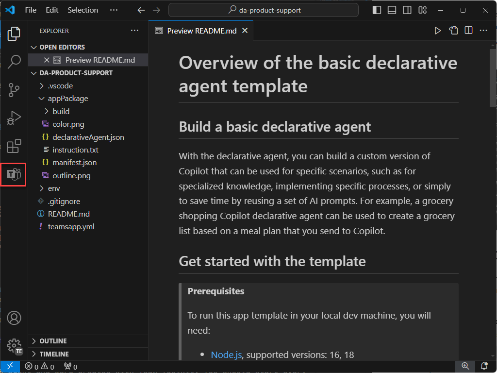

1. In the **Lifecycle** section, select **Provision**.

    

1. In the prompt, select **Sign in** and follow the prompts to sign in to your Microsoft 365 tenant using Teams Toolkit. The provisioning process starts automatically after you sign in.

    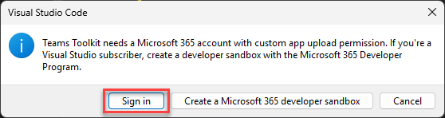

    

1. Wait for the upload to complete before continuing.

    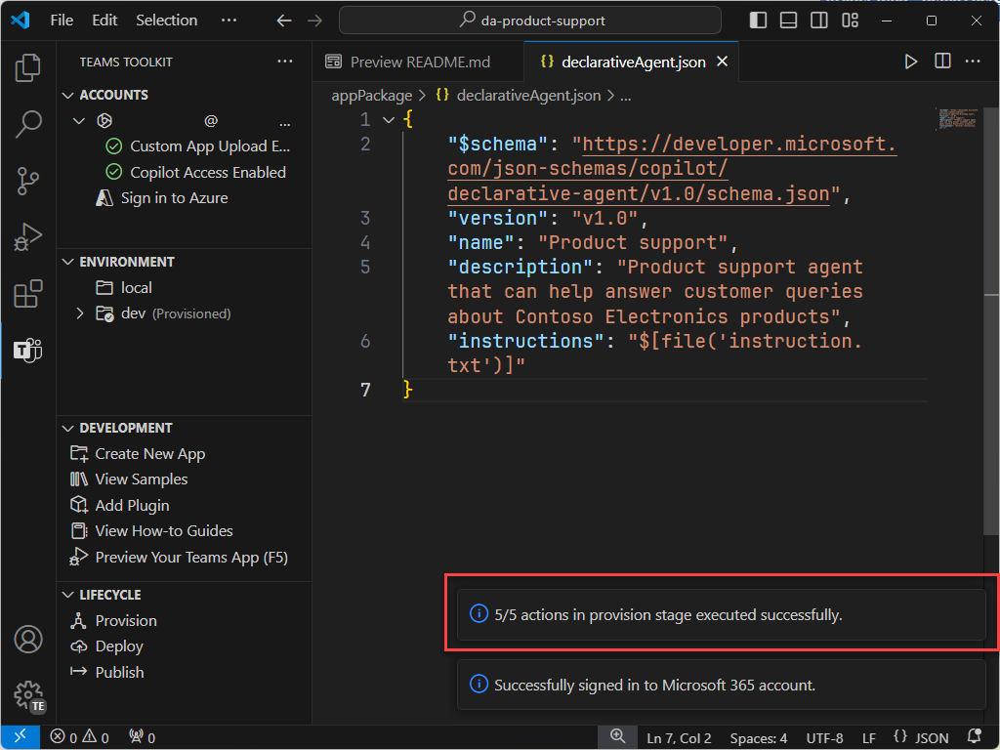

Next, review the output of the provisioning process.

- In the **appPackage/build** folder, open **declarativeAgent.dev.json** file.

Notice that the **instructions** property value contains the contents of the **instruction.txt** file. The **declarativeAgent.dev.json** file is included in the **appPackage.dev.zip** file along with the **manifest.dev.json**, **color.png**, and **outline.png** files. The **appPackage.dev.zip** file is uploaded to Microsoft 365.

## Task 5 - Test the declarative agent in Microsoft 365 Copilot

Next, let’s run the declarative agent in Microsoft 365 Copilot and validate its functionality in both the **in-context** and **immersive** experiences.

In Visual Studio Code:

1. In the **Activity Bar**, switch to the **Run and Debug** view.

    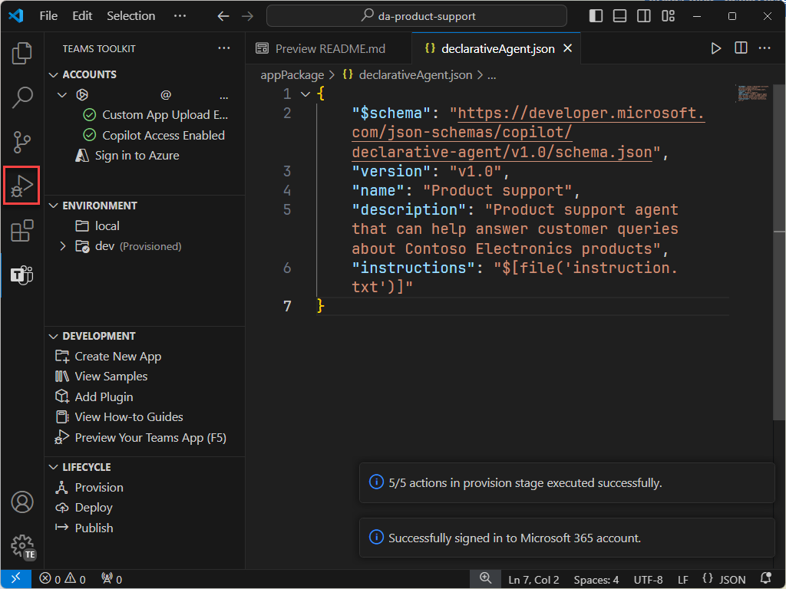

1. Select the **Start Debugging** button next to the configuration’s dropdown, or press <kbd>F5</kbd>. A new browser window is launched and navigates to Microsoft 365 Copilot.

    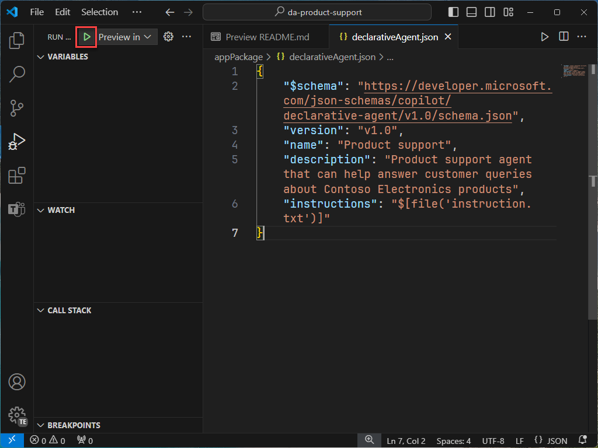

    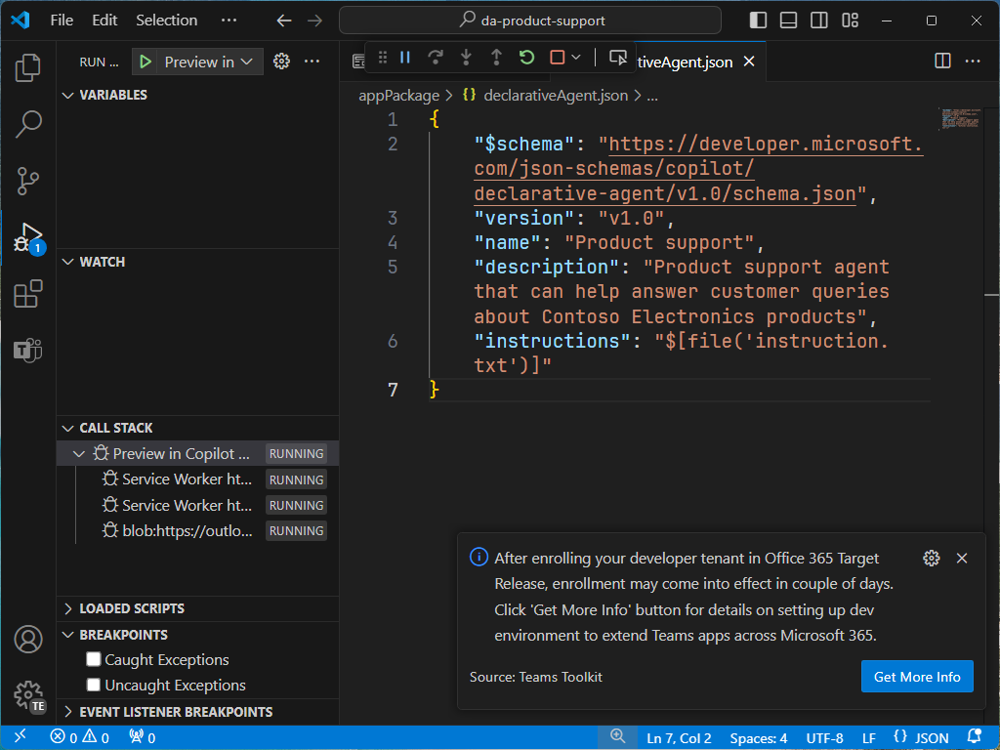

    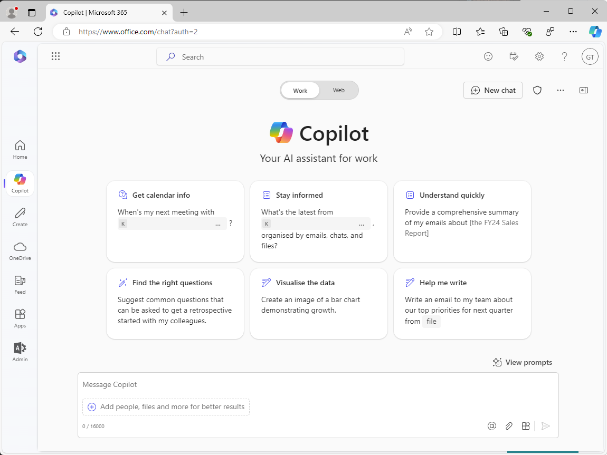

Continuing in the browser, let’s test the **in-context** experience.

1. In **Microsoft 365 Copilot**, in the message box enter the <kbd>@</kbd> symbol. The flyout appears with a list of available agents.

    

1. In the flyout, select **Product support**. Notice the status message above the message box. It displays **Chatting with Product support**, which signifies that you're using the in-context experience of the agent.

    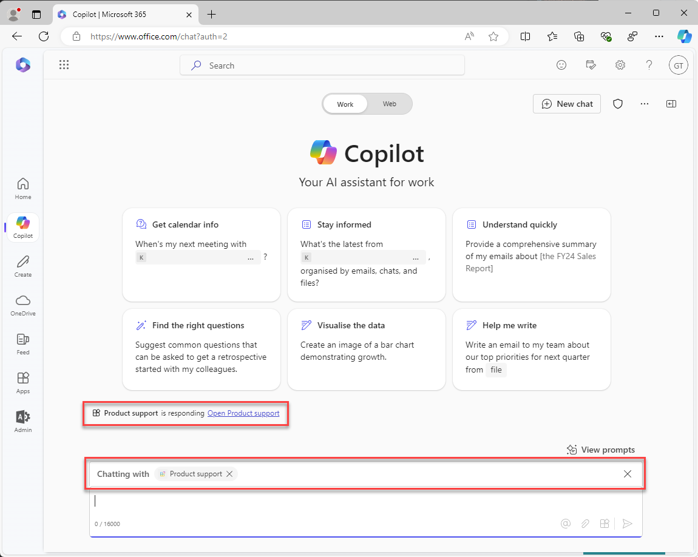

1. In the text box, enter **What can you do?** and submit your message.

    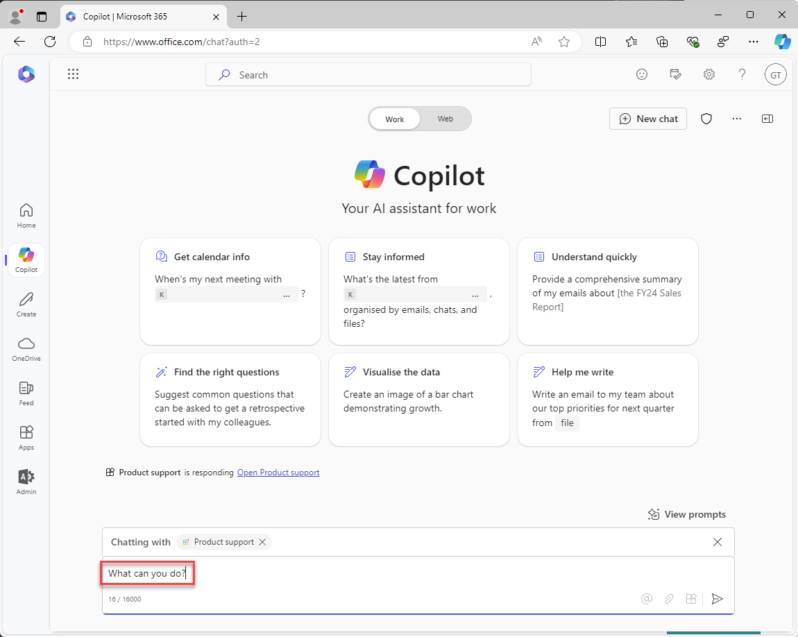

1. Wait for the response. Notice how the response starts with the text "Thanks for using Teams Toolkit to create your declarative agent!" as defined in the instructions you reviewed earlier.

    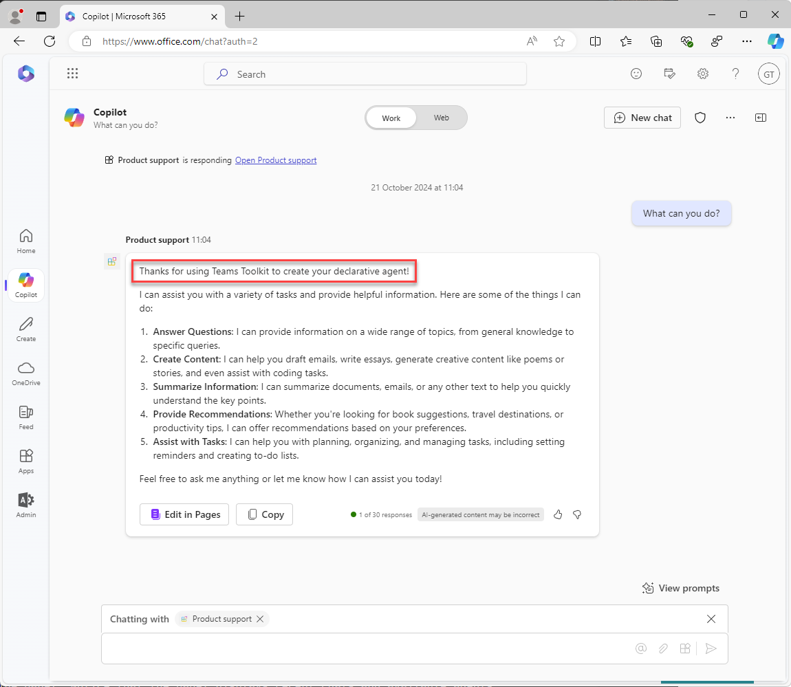

1. To exit the in-context experience, select the cross (X) in the status message. Notice the status message is removed and a message is displayed in the chat window that indicates that you're no longer chatting with the agent.

    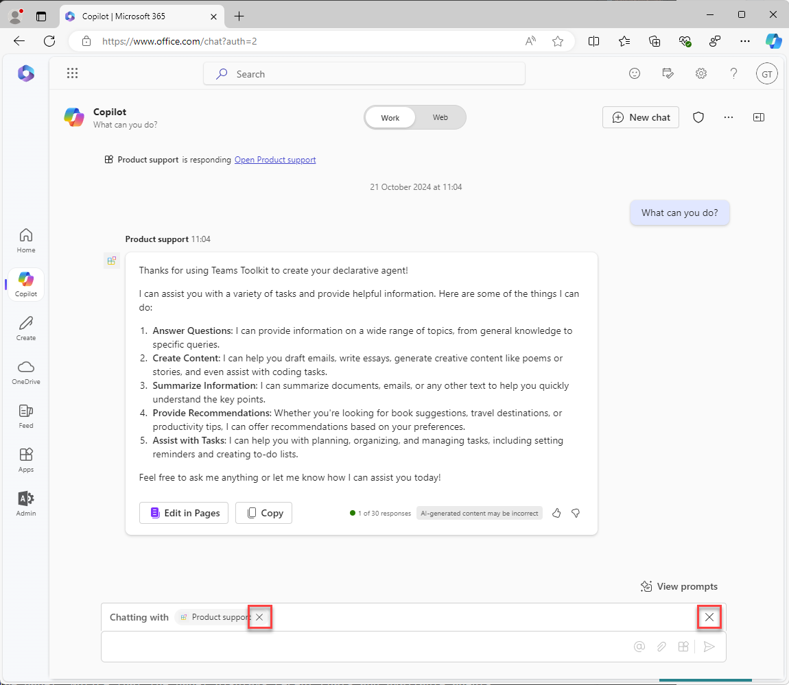

    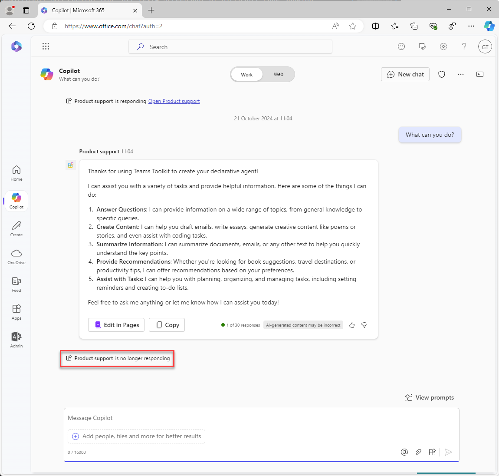

Finally, let’s test the **immersive** experience.

Continuing in the browser:

1. In **Microsoft 365 Copilot**, select the icon in the top right to expand the Copilot side panel. Notice that the panel displays recent chats and available agents.

    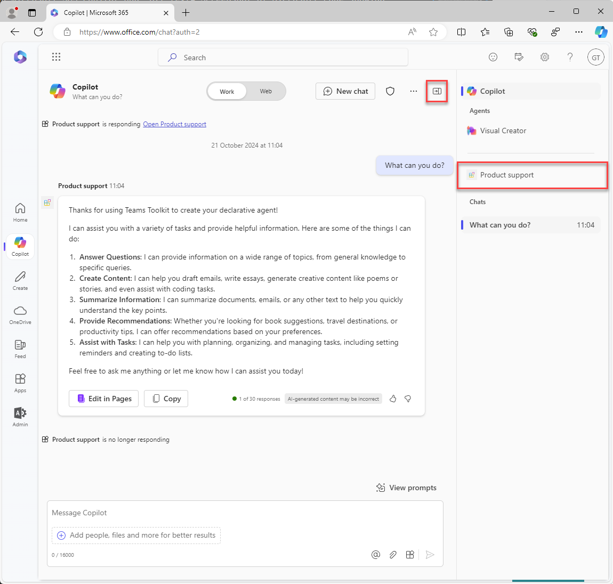

1. In the side panel, select **Product support** to enter the immersive experience and chat directly with the agent. Notice two sample prompts displayed in the interface.

    

1. Select the sample prompt with the title **Learn more**. Notice that the text **What can you do?** is added to the message box for you.

    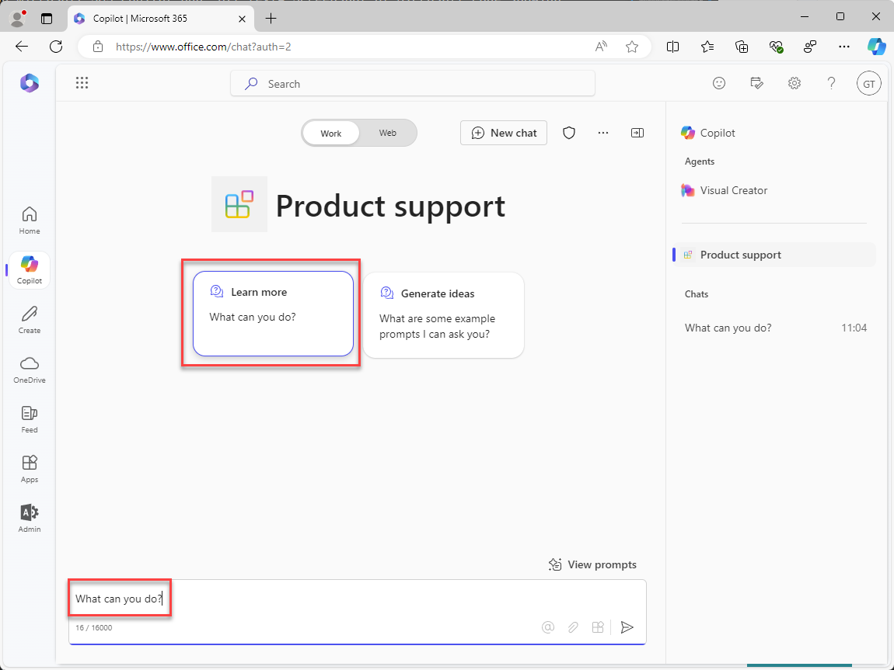

1. Send the message and wait for the response. Notice how the response starts with the text "Thanks for using Teams Toolkit to create your declarative agent!" as defined in the instructions you reviewed earlier.

    

Finally, close the browser to stop the debug session in Visual Studio Code.