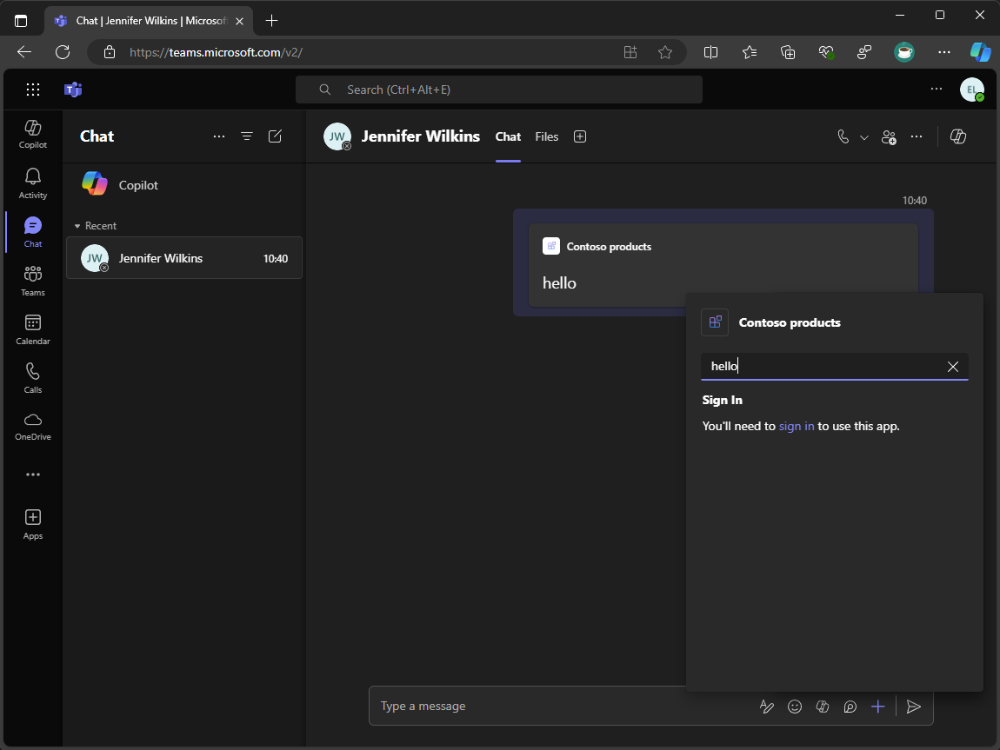

---
lab:
    title: 'Exercise 2 - Add single sign-on'
    module: 'LAB 03: Connect Copilot for Microsoft 365 to your external data in real-time with message extension plugins built with .NET and Visual Studio'
---

# Exercise 2 - Add single sign-on

In this exercise, you add single sign-on to the message extension to authenticate user queries.



## Task 1 - Configure backend API app registration

First, create a Microsoft Entra app registration for the backend API. For the purposes of this exercise, you create a new one, however, in a production environment, you would use an existing app registration.

In a browser window:

1. Navigate to the [Azure portal](https://portal.azure.com)
1. Open the portal menu and select **Microsoft Entra ID**
1. Select **App registrations** and then select **New registration**
1. In the Register an application form, specify the following values:
    1. **Name**: Products API
    1. **Support account types**: Accounts in any organizational directory (Any Microsoft Entra ID tenant - Multitenant)
1. Select **Register** to create the app registration
1. In the app registration left hand menu, select **Expose an API**
1. Select **Add** and **Save** create a new Application ID URI
1. In the Scopes defined by this API section, select **Add a scope**
1. In the Add a scope form, specify the following values:
    1. **Scope name**: Product.Read
    1. **Who can consent?**: Admins and users
    1. **Admin consent display name**: Read products
    1. **Admin consent description**: Allows the app to read product data
    1. **User consent display name**: Read products
    1. **User consent description**: Allows the app to read product data
    1. **State**: Enabled
1. Select **Add scope** to create the scope

Next, take a note of the app registration ID and the scope ID. You need these values to configure the app registration used to obtain an access token for the backend API.

1. In the app registration left hand menu, select **Manifest**
1. Copy the **appId** property value and save it for later use
1. Copy the **api.oauth2PermissionScopes[0].id** property value and save it for later use

As we need these values in the project, add them to the environment file.

In Visual Studio and the TeamsApp project:

1. In the **env** folder, open **.env.local**
1. In the file, create the following environment variables and set the values to the app registration ID and scope ID:

    ```text
    BACKEND_API_ENTRA_APP_ID=<app-registration-id>
    BACKEND_API_ENTRA_APP_SCOPE_ID=<scope-id>
    ```

1. Save your changes

## Task 2 - Create an app registration manifest file for authentication with the backend API

To authenticate with the backend API, you need an app registration to obtain an access token to call the API with.

Next, create an app registration manifest file. The manifest defines the API permission scopes and redirect URI on the app registration.

In Visual Studio and the TeamsApp project:

1. In the **infra\entra** folder, create a file named **entra.products.api.manifest.json**
1. In the file, add the following code:

    ```json
    {
      "id": "${{PRODUCTS_API_ENTRA_APP_OBJECT_ID}}",
      "appId": "${{PRODUCTS_API_ENTRA_APP_ID}}",
      "name": "${{APP_INTERNAL_NAME}}-product-api-${{TEAMSFX_ENV}}",
      "accessTokenAcceptedVersion": 2,
      "signInAudience": "AzureADMultipleOrgs",
      "optionalClaims": {
        "idToken": [],
        "accessToken": [
          {
            "name": "idtyp",
            "source": null,
            "essential": false,
            "additionalProperties": []
          }
        ],
        "saml2Token": []
      },
      "requiredResourceAccess": [
        {
          "resourceAppId": "${{BACKEND_API_ENTRA_APP_ID}}",
          "resourceAccess": [
            {
              "id": "${{BACKEND_API_ENTRA_APP_SCOPE_ID}}",
              "type": "Scope"
            }
          ]
        }
      ],
      "oauth2Permissions": [],
      "preAuthorizedApplications": [],
      "identifierUris": [],
      "replyUrlsWithType": [
        {
          "url": "https://token.botframework.com/.auth/web/redirect",
          "type": "Web"
        }
      ]
    }
    ```

1. Save your changes

The **requiredResourceAccess** property specifies the app registration ID and the scope ID of the backend API.

The **replyUrlsWithType** property specifies the redirect URI used by the Bot Framework Token Service to return the access token to the token service after the user authenticates.

Next, update the automated workflow to create and update the app registration.

In the TeamsApp project:

1. Open **teamsapp.local.yml**
1. In the file, find the step that uses the **addApp/update** action
1. After the action, add the **aadApp/create** and **aadApp/update** actions to create and update the app registration:

    ```yml
      - uses: aadApp/create
        with:
            name: ${{APP_INTERNAL_NAME}}-products-api-${{TEAMSFX_ENV}}
            generateClientSecret: true
            signInAudience: AzureADMultipleOrgs
        writeToEnvironmentFile:
            clientId: PRODUCTS_API_ENTRA_APP_ID
            clientSecret: SECRET_PRODUCTS_API_ENTRA_APP_CLIENT_SECRET
            objectId: PRODUCTS_API_ENTRA_APP_OBJECT_ID
            tenantId: PRODUCTS_API_ENTRA_APP_TENANT_ID
            authority: PRODUCTS_API_ENTRA_APP_OAUTH_AUTHORITY
            authorityHost: PRODUCTS_API_ENTRA_APP_OAUTH_AUTHORITY_HOST
    
      - uses: aadApp/update
        with:
            manifestPath: "./infra/entra/entra.products.api.manifest.json"
            outputFilePath : "./infra/entra/build/entra.products.api.${{TEAMSFX_ENV}}.json"
    ```

1. Save your changes

The **aadApp/create** action creates a new app registration with the specified name, audience, and generates a client secret. The **writeToEnvironmentFile** property writes the app registration ID, client secret, object ID, tenant ID, authority, and authority host to the environment files. The client secret is encrypted and stored securely in the **env.local.user** file. The environment variable name for the client secret is prefixed with **SECRET_**, it tells Teams Toolkit to not write the value in the logs.

The **aadApp/update** action updates the app registration with the specified manifest file.

## Task 3 - Centralize connection setting name

First, centralize the connection setting name in the environment file and update the app configuration to access the environment variable value at runtime.

Continuing in Visual Studio and in the TeamsApp project:

1. In the **env** folder, open **.env.local**
1. In the file, add the following code:

    ```text
    CONNECTION_NAME=ProductsAPI
    ```

1. Open **teamsapp.local.yml**
1. In the file, find the step that uses the **file/createOrUpdateJsonFile** action targeting the **./appsettings.Development.json** file. Update the content array to include the **CONNECTION_NAME** environment variable and write the value to the **appsettings.Development.json** file:

    ```yml
      - uses: file/createOrUpdateJsonFile
        with:
          target: ../ProductsPlugin/appsettings.Development.json
          content:
            BOT_ID: ${{BOT_ID}}
            BOT_PASSWORD: ${{SECRET_BOT_PASSWORD}}
            CONNECTION_NAME: ${{CONNECTION_NAME}}
    ```

1. Save your changes

Next, update the app configuration to access the **CONNECTION_NAME** environment variable.

In the ProductsPlugin project:

1. Open **Config.cs**
1. In the **ConfigOptions** class, add a new property named **CONNECTION_NAME**

    ```csharp
    public class ConfigOptions
    {
      public string BOT_ID { get; set; }
      public string BOT_PASSWORD { get; set; }
      public string CONNECTION_NAME { get; set; }
    }
    ```

1. Save your changes
1. Open **Program.cs**
1. In the file, update the code that reads the app configuration to include the **CONNECTION_NAME** property

    ```csharp
    var config = builder.Configuration.Get<ConfigOptions>();
    builder.Configuration["MicrosoftAppType"] = "MultiTenant";
    builder.Configuration["MicrosoftAppId"] = config.BOT_ID;
    builder.Configuration["MicrosoftAppPassword"] = config.BOT_PASSWORD;
    builder.Configuration["ConnectionName"] = config.CONNECTION_NAME;
    ```

1. Save your changes

Next, update the bot code to use the connection setting name at run time.

1. In the **Search** folder, open **SearchApp.cs**
1. In the **SearchApp** class, create a constructor that accepts an **IConfiguration** object and assigns the value of the **CONNECTION_NAME** property to a private field named **connectionName**

    ```csharp
    public class SearchApp : TeamsActivityHandler
    {
      private readonly string connectionName;
    
      public SearchApp(IConfiguration configuration)
      {
        connectionName = configuration["CONNECTION_NAME"];
      }  
    }
    ```

1. Save your changes

## Task 4 - Configure the Products API connection setting

To authenticate with the backend API, you need to configure a connection setting in the Azure Bot resource.

Continuing in Visual Studio and the TeamsApp project:

1. In the **infra** folder, open **azure.parameters.local.json**
1. In the file, add the **backendApiEntraAppClientId**, **productsApiEntraAppClientId**, **productsApiEntraAppClientSecret**, and **connectionName** parameters

    ```json
    {
      "$schema": "https://schema.management.azure.com/schemas/2015-01-01/deploymentParameters.json#",
      "contentVersion": "1.0.0.0",
      "parameters": {
        "resourceBaseName": {
          "value": "bot-${{RESOURCE_SUFFIX}}-${{TEAMSFX_ENV}}"
        },
        "botEntraAppClientId": {
          "value": "${{BOT_ID}}"
        },
        "botDisplayName": {
          "value": "${{APP_DISPLAY_NAME}}"
        },
        "botAppDomain": {
          "value": "${{BOT_DOMAIN}}"
        },
        "backendApiEntraAppClientId": {
          "value": "${{BACKEND_API_ENTRA_APP_ID}}"
        },
        "productsApiEntraAppClientId": {
          "value": "${{PRODUCTS_API_ENTRA_APP_ID}}"
        },
        "productsApiEntraAppClientSecret": {
          "value": "${{SECRET_PRODUCTS_API_ENTRA_APP_CLIENT_SECRET}}"
        },
        "connectionName": {
          "value": "${{CONNECTION_NAME}}"
        }
      }
    }
    ```

1. Save your changes

Next, update the Bicep file to include the new parameters and pass them to the Azure Bot resource.

1. In the **infra** folder, open the file named **azure.local.bicep**
1. In the file, after the **botAppDomain** parameter declaration, add the **backendApiEntraAppClientId**, **productsApiEntraAppClientId**, **productsApiEntraAppClientSecret**, and **connectionName** parameter declarations

    ```bicep
    param backendApiEntraAppClientId string
    param productsApiEntraAppClientId string
    @secure()
    param productsApiEntraAppClientSecret string
    param connectionName string
    ```

1. In the **azureBotRegistration** module declaration, add the new parameters

    ```bicep
    module azureBotRegistration './botRegistration/azurebot.bicep' = {
      name: 'Azure-Bot-registration'
      params: {
        resourceBaseName: resourceBaseName
        botEntraAppClientId: botEntraAppClientId
        botAppDomain: botAppDomain
        botDisplayName: botDisplayName
        backendApiEntraAppClientId: backendApiEntraAppClientId
        productsApiEntraAppClientId: productsApiEntraAppClientId
        productsApiEntraAppClientSecret: productsApiEntraAppClientSecret
        connectionName: connectionName
      }
    }
    ```

1. Save your changes.

Finally, update the bot registration Bicep file to include the new connection setting.

1. In the **infra/botRegistration** folder, open **azurebot.bicep**
1. In the file, after **botAppDomain** parameter declaration, add the **backendApiEntraAppClientId**, **productsApiEntraAppClientId**, **productsApiEntraAppClientSecret**, and **connectionName** parameter declarations

    ```bicep
    param backendApiEntraAppClientId string
    param productsApiEntraAppClientId string
    @secure()
    param productsApiEntraAppClientSecret string
    param connectionName string
    ```

1. In the file, create a new resource named **botServicesProductsApiConnection**

    ```bicep
    resource botServicesProductsApiConnection 'Microsoft.BotService/botServices/connections@2022-09-15' = {
      parent: botService
      name: connectionName
      location: 'global'
      properties: {
        serviceProviderDisplayName: 'Azure Active Directory v2'
        serviceProviderId: '30dd229c-58e3-4a48-bdfd-91ec48eb906c'
        clientId: productsApiEntraAppClientId
        clientSecret: productsApiEntraAppClientSecret
        scopes: 'api://${backendApiEntraAppClientId}/Product.Read'
        parameters: [
          {
            key: 'tenantID'
            value: 'common'
          }
          {
            key: 'tokenExchangeUrl'
            value: 'api://${botAppDomain}/botid-${botEntraAppClientId}'
          }
        ]
      }
    }
    ```

1. Save your changes

## Task 5 - Configure authentication in the message extension

To authenticate user queries in the message extension, you use the Bot Framework SDK to obtain an access token for the user from the Bot Framework Token Service. The access token can then be used to access data from an external service.

To simplify the code, create a helper class that handles user authentication.

Continuing in Visual Studio and the ProductsPlugin project:

1. Create a new folder named **Helpers**
1. In the **Helpers** folder, create a new class file named **AuthHelpers.cs**
1. In the file, add the following code:

    ```csharp
    using Microsoft.Bot.Connector.Authentication;
    using Microsoft.Bot.Schema;
    using Microsoft.Bot.Schema.Teams;
    
    internal static class AuthHelpers
    {
        internal static async Task<MessagingExtensionResponse> CreateAuthResponse(UserTokenClient userTokenClient, string connectionName, Activity activity, CancellationToken cancellationToken)
        {
            var resource = await userTokenClient.GetSignInResourceAsync(connectionName, activity, null, cancellationToken);
    
            return new MessagingExtensionResponse
            {
                ComposeExtension = new MessagingExtensionResult
                {
                    Type = "auth",
                    SuggestedActions = new MessagingExtensionSuggestedAction
                    {
                        Actions = [
                            new() {
                                Type = ActionTypes.OpenUrl,
                                Value = resource.SignInLink,
                                Title = "Sign In",
                            },
                        ],
                    },
                },
            };
        }
    
        internal static async Task<TokenResponse> GetToken(UserTokenClient userTokenClient, string state, string userId, string channelId, string connectionName, CancellationToken cancellationToken)
        {
            var magicCode = string.Empty;
    
            if (!string.IsNullOrEmpty(state))
            {
                if (int.TryParse(state, out var parsed))
                {
                    magicCode = parsed.ToString();
                }
            }
    
            return await userTokenClient.GetUserTokenAsync(userId, connectionName, channelId, magicCode, cancellationToken);
        }
    
        internal static bool HasToken(TokenResponse tokenResponse) => tokenResponse != null && !string.IsNullOrEmpty(tokenResponse.Token);
    }
    ```

1. Save your changes

The three helper methods in the **AuthHelpers** class handle user authentication in the message extension.

- **CreateAuthResponse** method constructs a response that renders a sign-in link in the user interface. The sign-in link is retrieved from the token service using the **GetSignInResourceAsync** method.
- **GetToken** method uses the token service client to obtain an access token for the current user. The method uses a magic code to verify the authenticity of the request.
- **HasToken** method checks if the response from the token service contains an access token. If the token isn't null or empty, the method returns true.

Next, update the message extension code to use the helper methods to authenticate user queries.

1. In the **Search** folder, open **SearchApp.cs**
1. At the top of the file, add the following using statement:

    ```csharp
    using Microsoft.Bot.Connector.Authentication;
    ```

1. In the **OnTeamsMessagingExtensionQueryAsync** method, add the following code at the beginning of the method:

    ```csharp
    var userTokenClient = turnContext.TurnState.Get<UserTokenClient>();
    var tokenResponse = await AuthHelpers.GetToken(userTokenClient, query.State, turnContext.Activity.From.Id, turnContext.Activity.ChannelId, connectionName, cancellationToken);

    if (!AuthHelpers.HasToken(tokenResponse))
    {
        return await AuthHelpers.CreateAuthResponse(userTokenClient, connectionName, (Activity)turnContext.Activity, cancellationToken);
    }
    ```

1. Save your changes

Next, add the Token Service domain to the app manifest file to ensure that the client can trust the domain when initiating a single sign-on flow.

In the TeamsApp project:

1. In the **appPackage** folder, open **manifest.json**
1. In the file, update the **validDomains** array, add the domain of the token service:

    ```json
    "validDomains": [
        "token.botframework.com",
        "${{BOT_DOMAIN}}"
    ]
    ```

1. Save your changes

## Task 6 - Create and update resources

With everything now in place, run the **Prepare Teams App Dependencies** process to create new resources and update existing ones.

Continuing in Visual Studio:

1. In **Solution Explorer**, right-click the **TeamsApp** project
1. Expand the **Teams Toolkit** menu, select **Prepare Teams App Dependencies**
1. In the **Microsoft 365 account** dialog, select **Continue**
1. In the **Provision** dialog, select **Provision**
1. In the **Teams Toolkit warning** dialog, select **Provision**
1. In the **Teams Toolkit information** dialog, select the cross icon to close the dialog

## Task 7 - Run and debug

With the resources provisioned, start a debugging session to test the message extension.

1. To start a new debug session, press <kbd>F5</kbd> or select **Start** from the toolbar
1. Wait until a browser window opens and the app install dialog appears in the Microsoft Teams web client. If prompted, enter your Microsoft 365 account credentials.
1. In the app install dialog, select **Add**
1. Open a new, or existing Microsoft Teams chat
1. In the message compose area, select **+** to open the app picker
1. In the list of apps, select **Contoso products** to open the message extension
1. In the text box, enter **hello**
1. A message, **You'll need to sign in to use this app** is shown

    

1. Follow the **sign in** link to start the authentication flow
1. Consent to the permissions requested and return to Microsoft Teams

    

1. Wait for the search to complete and the results to be displayed
1. In the list of results, select **hello** to embed a card into the compose message box

Return to Visual Studio and select **Stop** from the toolbar or press <kbd>Shift</kbd> + <kbd>F5</kbd> to stop the debug session.

[Continue to the next exercise...](./4-exercise-return-data-api.md)