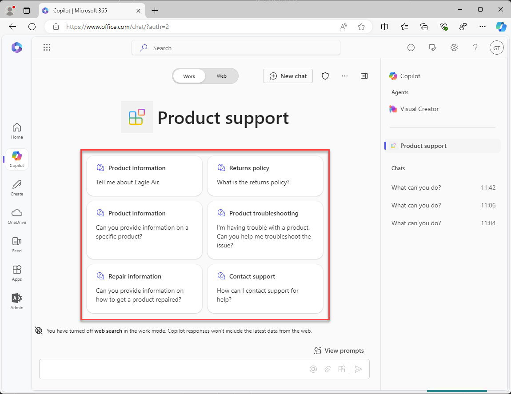

---
lab:
    title: 'Exercise 3 - Add conversation starters to your declarative agent'
    module: 'LAB 01: Build a declarative agent for Microsoft 365 Copilot using Visual Studio Code'
---

# Exercise 3 - Add conversation starters to your declarative agent

In this exercise, you will update the declarative agent to include conversation starters that provide users with sample prompts to help them understand the types of questions they can ask.

### Exercise Duration

- **Estimated Time to complete**: 5 minutes

## Task 1 - Add conversation starters

In Visual Studio Code:

1. In the **appPackage** folder, open the **declarativeAgent.json** file.
1. Add the following code snippet to the file:

   ```json
   "conversation_starters": [
       {
           "title": "Product information",
           "text": "Tell me about Eagle Air"
       },
       {
           "title": "Returns policy",
           "text": "What is the returns policy?"
       },
       {
           "title": "Product information",
           "text": "Can you provide information on a specific product?"
       },
       {
           "title": "Product troubleshooting",
           "text": "I'm having trouble with a product. Can you help me troubleshoot the issue?"
       },
       {
           "title": "Repair information",
           "text": "Can you provide information on how to get a product repaired?"
       },
       {
           "title": "Contact support",
           "text": "How can I contact support for help?"
       }
   ]
   ```

1. Save your changes.

The **declarativeAgent.json** file should look like this:

```json
{
  "$schema": "https://developer.microsoft.com/json-schemas/copilot/declarative-agent/v1.0/schema.json",
  "version": "v1.0",
  "name": "Product support",
  "description": "Product support agent that can help answer customer queries about Contoso Electronics products",
  "instructions": "$[file('instruction.txt')]",
  "capabilities": [
    {
      "name": "OneDriveAndSharePoint",
      "items_by_url": [
        {
          "url": "https://{tenant}-my.sharepoint.com/personal/{user}/Documents/Products"
        }
      ]
    }
  ],
  "conversation_starters": [
    {
      "title": "Product information",
      "text": "Tell me about Eagle Air"
    },
    {
      "title": "Returns policy",
      "text": "What is the returns policy?"
    },
    {
      "title": "Product information",
      "text": "Can you provide information on a specific product?"
    },
    {
      "title": "Product troubleshooting",
      "text": "I'm having trouble with a product. Can you help me troubleshoot the issue?"
    },
    {
      "title": "Repair information",
      "text": "Can you provide information on how to get a product repaired?"
    },
    {
      "title": "Contact support",
      "text": "How can I contact support for help?"
    }
  ]
}
```

## Task 2 - Test the declarative agent in Microsoft 365 Copilot

Next, upload your changes and start a debug session.

In Visual Studio Code:

1. In the **Activity Bar**, open the **Teams Toolkit** extension.
1. In the **Lifecycle** section, select **Provision**.
1. Wait for the upload to complete.
1. In the **Activity Bar**, switch to the **Run and Debug** view.
1. Select the **Start Debugging** button next to the configuration’s dropdown, or press <kbd>F5</kbd>. A new browser window is launched and navigates to Microsoft 365 Copilot.

Next, test your declarative agent in Microsoft 365 and validate the results.

Continuing in the web browser:

1. In **Microsoft 365 Copilot**, select the icon in the top right to expand the **Copilot side panel**.
1. Find **Product support** in the list of agents and select it to enter the immersive experience to chat directly with the agent. Notice that the conversation starters you defined in the manifest display in the user interface.



Close the browser to stop the debug session in Visual Studio Code.