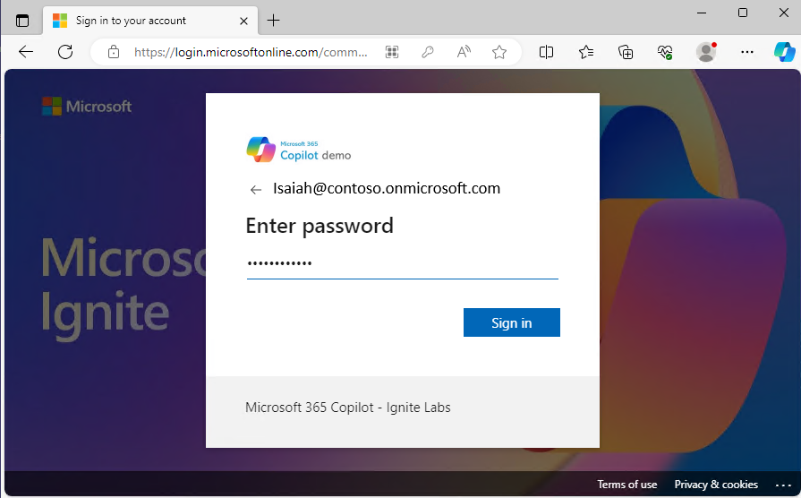
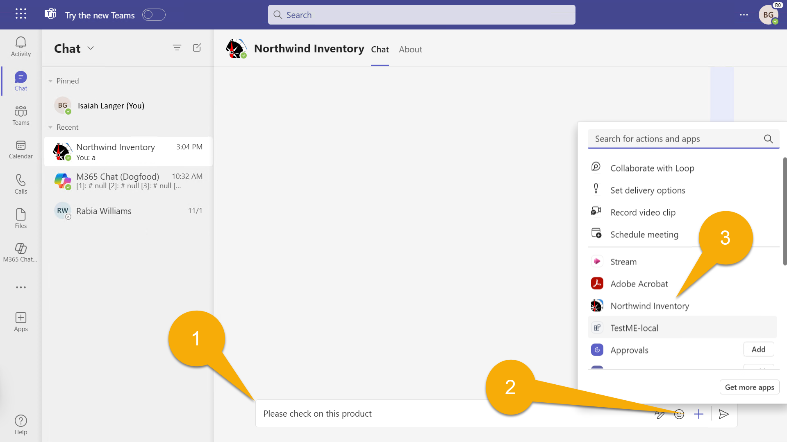
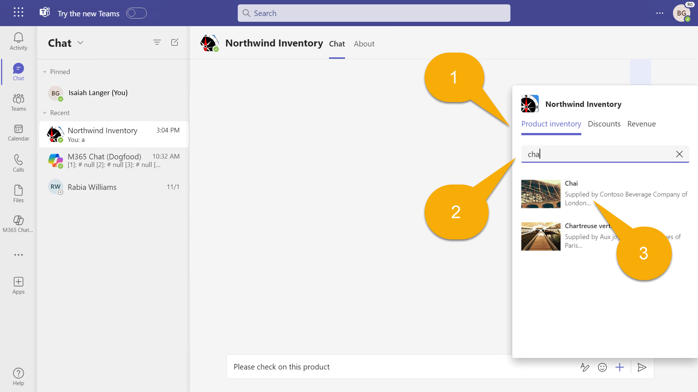
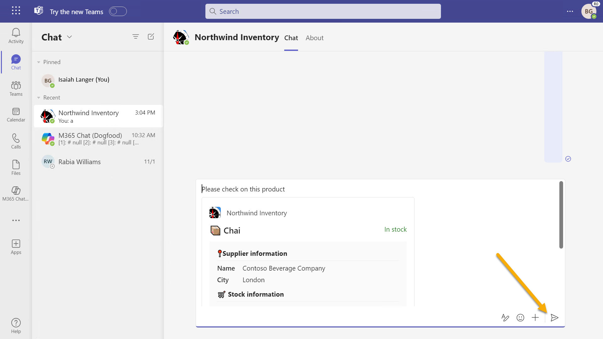
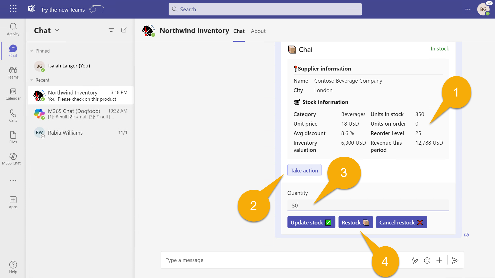
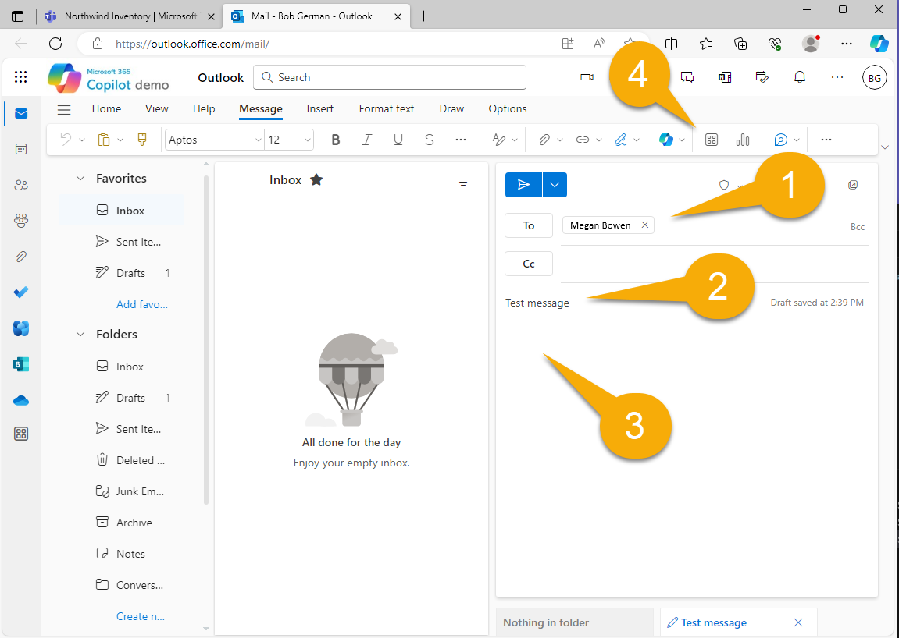
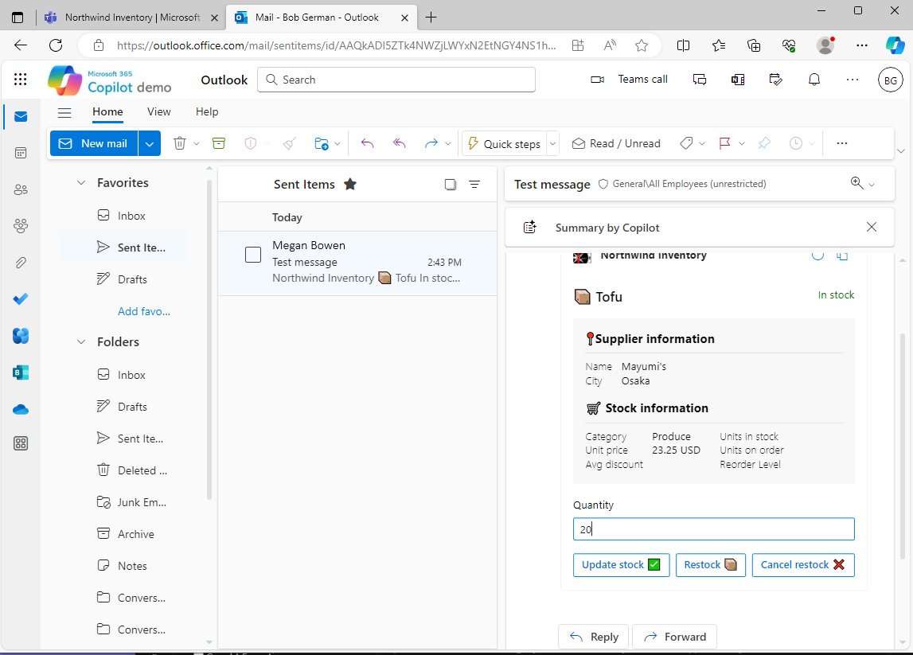

---
lab:
    title: 'Exercise 1 - Run the sample as a message extension'
    module: 'LAB 02: Build your own message extension plugin with TypeScript (TS) for Microsoft Copilot'
---

# Exercise 1 - Run the sample as a message extension

In this exercise, you'll run the application as a plugin for Teams and Outlook. You'll experiment with various prompts and you'll observe how the plugin gets invoked using different parameters.

## Task 1 - Set up the project for first use

In this project, the Northwind database is stored in Azure Table Storage; when you're debugging locally, it uses the [Azurite](https://learn.microsoft.com/azure/storage/common/storage-use-azurite?tabs=visual-studio) storage emulator. That's mostly built into the project, but the project won't build unless you provide the connection string.

The Teams Toolkit stores environment variables in the **env** folder, and it will fill in all the values automatically when you start your project the first time. However there's one value that's specific to the sample application, and that's the connection string for accessing the Northwind database. The necessary setting is provided in a file **env/.env.local.user.sample**. 

Make a copy of this file in the **env** folder, and call it **.env.local.user**. This is where secret or sensitive settings are stored.

If you're not sure how to do this in Visual Studio Code: 

1. Expand the **env** folder and right-click on **.env.local.user.sample**. Select **Copy**. 

1. Then right-click anywhere in the **env** folder and select **Paste**. You'll have a new file called **.env.local.user copy.sample**. 

1. Use the same context menu to rename the file to **.env.local.user** and you're done.

    

The resulting **.env.local.user** file should contain this line:

```console
SECRET_STORAGE_ACCOUNT_CONNECTION_STRING=UseDevelopmentStorage=true
```

## Task 2 - Run the application locally

1. In Visual Studio Code with the **working folder** open, press **F5** to start debugging, or select the start button 1️⃣.

1. Select **Debug in Teams (Edge)** 2️⃣.

    

    The first time your app runs, you may be prompted to allow NodeJS to go through your firewall; this is necessary to allow the application to communicate.

    It may take a while the first time as it's loading all the npm packages. Eventually, a browser window will open and invite you to sign in.

    

    Once you're signed in, Microsoft Teams should open up and display a dialog offering to install your application. Observe the information displayed; which is derived from the **app manifest**.

1. Select **Add** to add Northwind Inventory as a personal application.

    

> [!NOTE]
> If you see this screen, you need to fix your **env/.env.local.user** file; this is explained in the previous task.
>
> 

You should be directed to a chat within the application, however you could use the app in any chat.

## Task 3 - Test in Microsoft Teams

1. In the **Northwind Inventory chat** - begin typing a message 1️⃣ that refers to a product. Then, to insert an adaptive card for the product, select  **+** 2️⃣. 

1. In the fly-up panel, select the **Northwind Inventory** application you just installed 3️⃣.

    

  You'll see a search dialog with 2 tabs 1️⃣. The **Product Inventory** tab allows searching for products by name.

1. Type a product name, or the beginning of a product name such as **chai** into the search box 2️⃣. If you pause as you type the first letters, you'll be given more choices of products that begin with the same characters.

1. Select **Chai** 3️⃣ to insert an adaptive card into the conversation along with your comment.

    

1. You can see the card, but you can't use it until you send it. Make any final edits to your message and select **Send**. Notice that there's no chai on order 1️⃣. We must have some frequent chai drinkers and they might be stopping by so you'd better order more! 

    

    > [!NOTE]
    > Adaptive Card actions won't work until you send the card. If you get an error, please check and make sure you've sent the message and are working with the card after it has been sent.

1. Select the **take action** button 2️⃣ to open a child card. Enter a quantity 3️⃣ and select the **Restock** button 4️⃣. The card will refresh with a success message and an updated number of units on order.

    

You can cancel the order or modify the stock levels using the other two buttons.

## Task 4 - Advanced queries

Back in Visual Studio Code, open the app manifest file called **manifest.json** in the **appPackage** directory. You'll notice that the app information that was displayed when you installed the app is all here. Scroll down and find `composeExtensions:`. 

```json
"composeExtensions": [
    {
        "botId": "${{BOT_ID}}",
        "commands": [
            {
                "id": "inventorySearch",
                ...
                "description": "Search products by name, category, inventory status, supplier location, stock level",
                "title": "Product inventory",
                "type": "query",
                "parameters": [ ... ]
            },
            {
                "id": "discountSearch",
                ...
                "description": "Search for discounted products by category",
                "title": "Discounts",
                "type": "query",
                "parameters": [ ...]
            }
        ]
    }
],
```

> [!NOTE]
> Compose extensions is the historical name for a message extension; the Northwind Inventory message extension is defined here.

First, notice the **bot ID** provisioned by Microsoft Teams, which uses the Azure bot channel to exchange secure, real-time messages with your application. The Teams Toolkit will register the bot and fill in the ID for you.

Next, observe the collection of commands. These correspond to the tabs in the search dialog in Teams. In this application, the commands are primarily intended for Copilot more than regular users!

You already ran the first command when you searched for a product by name. To try out the other commands enter **Beverages**, **Dairy**, or **Produce** into the **Discounts** tab, and you'll see the discounted products in those categories. Copilot can use your query to answer questions about discounted products.


Now examine the first command again. You'll notice it has 5 parameters!

```json
"parameters": [
    {
        "name": "productName",
        "title": "Product name",
        "description": "Enter a product name here",
        "inputType": "text"
    },
    {
        "name": "categoryName",
        "title": "Category name",
        "description": "Enter the category of the product",
        "inputType": "text"
    },
    {
        "name": "inventoryStatus",
        "title": "Inventory status",
        "description": "Enter what status of the product inventory. Possible values are 'in stock', 'low stock', 'on order', or 'out of stock'",
        "inputType": "text"
    },
    {
        "name": "supplierCity",
        "title": "Supplier city",
        "description": "Enter the supplier city of product",
        "inputType": "text"
    },
    {
        "name": "stockQuery",
        "title": "Stock level",
        "description": "Enter a range of integers such as 0-42 or 100- (for >100 items). Only use if you need an exact numeric range.",
        "inputType": "text"
    }
]
```

While Teams can only display the first parameter; Copilot can use all 5, allowings it to do more advanced queries of the Northwind inventory data. As a workaround to the Teams UI limitation, the **Northwind Inventory** tab will accept up to 5 comma separated parameters, using the format:

```console
name,category,inventoryStatus,supplierCity,supplierName
```


Read the descriptions in the JSON above carefully when entering a query. Try entering the terms listed below, and as you do, keep an eye on the debug console tab in Visual Studio Code, where you'll see each query as it's run.

- **_chai_** - find products with names that begin with **chai**.

- **_c,bev_** - find products in categories beginning with **bev** and names that begin with **c**.

- **_,,out,_** - find products that are out of stock.

- **_,,in,London_** - find products that are on order from suppliers in London.

- **_tofu,produce,,Osaka_** - find products in the **produce** category with suppliers in **Osaka** and names that begin with **tofu**.

Each query term filters the list of products down. The format of each query term is arbitrary - just be sure to explain them to Copilot in the description of each parameter.

## Task 5 - Test in Microsoft Outlook

Let's take a brief detour so you can see how message extensions work in Microsoft Outlook.

1. First, open the Microsoft 365 app menu 1️⃣ and select **Outlook** 2️⃣.

    

1. Select **New mail** to begin composing an email.

    

1. Add a **recipient** 1️⃣ and a **subject** 2️⃣, then position your cursor in the body of the message 3️⃣. You can even type something. When you're ready, choose **Insert** from the toolbar and select **Apps** in the toolbar 4️⃣.

    

1. Select the **Northwind Inventory** application, searching if necessary to find it.

    

1. Search for **Chai** 1️⃣ as before and select the result to insert the adaptive card 2️⃣.

    

    

> [!NOTE]
> The adaptive card won't work until you send the message. The recipient won't be able to view the card if they don't use Microsoft Outlook and won't be able to take action on it if they don't have the Northwind Inventory app installed themselves.

## Task 6 - View Northwind database in Azure Storage Explorer

The Northwind Database isn't fancy but it's real! If you want to peek at or even modify the data:

1. Open the [Azure Storage Explorer](https://azure.microsoft.com/products/storage/storage-explorer/) while Azurite is running (running the app starts Azurite automatically).

1. Open **Emulator & Attached**, **Storage Accounts**, **Emulator - Default Ports**, and **Tables** to view the Northwind data.

    

The code reads the **Products** table on each query, but the other tables are only accessed when the app starts. So if you want to add a new category, you'll need to restart the app for it to appear.

## Check your work

After following all the tasks in this exercise, you should have a working message extension application that can be used as a Microsoft 365 plugin for Teams or Outlook.

When everything is working, you're ready to run the sample application in **Microsoft Copilot for Microsoft 365**! 

[Continue on to the next exercise...](./4-exercise-2-run-copilot-plugin.md)
