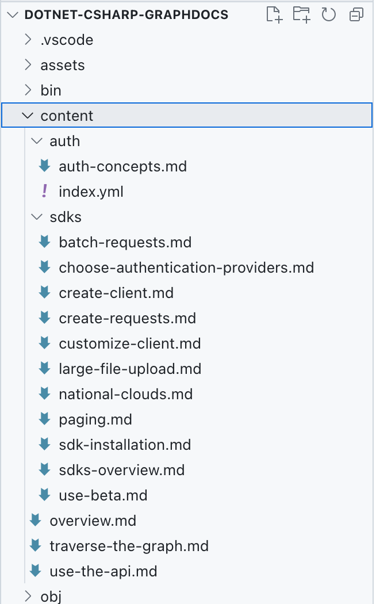

---
lab:
    title: 'Exercise 2 - Import external content'
    module: 'LAB 02: Integrate external content with Copilot for Microsoft 365 using Microsoft Graph connectors built with .NET'
---

# Exercise - Import external content

In this exercise, you extend the custom Microsoft Graph connector with the code to import local markdown files to Microsoft 365.

## Before you start

This exercise will take you about **XX minutes** to complete.

## Task 1 - Download external content

To follow this exercise, copy the sample content files used in this exercise from [GitHub](https://pnp.github.io/download-partial/?url=https://github.com/pnp/graph-connectors-samples/tree/main/samples/dotnet-csharp-graphdocs/content) and store them in your project, in a folder named **content**.



For the code to work correctly, the **content** folder and its contents must be copied to the build output folder.

In the code editor:

1. Open the **.csproj** file and before the `</Project>` tag, add the following code:

   ```xml
   <ItemGroup>
     <ContentFiles Include="content\**"    CopyToOutputDirectory="PreserveNewest" />
   </ItemGroup>
   
   <Target Name="CopyContentFolder" AfterTargets="Build">
     <Copy SourceFiles="@(ContentFiles)" DestinationFiles="@   (ContentFiles->'$(OutputPath)\content\%(RecursiveDir)%(Filename)%   (Extension)')" />
   </Target>
   ```

1. Save your changes.

## Task 2 - Add libraries to parse Markdown and YAML

The Microsoft Graph connector that you're building imports local Markdown files to Microsoft 365. Each of these files contains a header with metadata in the YAML format, also known as frontmatter. Additionally, the contents of each file are written in Markdown. To extract metadata and convert the body to HTML, you use custom libraries:

1. Open a terminal and change the working directory to your project.
1. To add the Markdown processing library, run the following command: `dotnet add package Markdig`.
1. To add the YAML processing library, run the following command: `dotnet add package YamlDotNet`.

## Task 3 - Define class to represent imported file

To simplify working with imported markdown files and their contents, let's define a class with the necessary properties.

In the code editor:

1. Create a new file named **ContentService.cs**.
1. Add the following code:

   ```csharp
   using YamlDotNet.Serialization;
   
   public interface IMarkdown
   {
     string? Markdown { get; set; }
   }
   
   class DocsArticle : IMarkdown
   {
     [YamlMember(Alias = "title")]
     public string? Title { get; set; }
     [YamlMember(Alias = "description")]
     public string? Description { get; set; }
     public string? Markdown { get; set; }
     public string? Content { get; set; }
     public string? RelativePath { get; set; }
   }
   ```

   The `IMarkdown` interface represents the contents of local markdown file. It needs to be defined separately to support deserializing file contents. The `DocsArticle` class, represent the final document with parsed YAML properties and HTML content. `YamlMember` attributes map properties to metadata in each document's header.

1. Save your changes.

## Task 4 - Define the `ContentService` class

Next, build a class that contains the code for loading local markdown files, transforming them into external items and loading them to Microsoft 365.

In the code editor:

1. Verify that you're editing the **ContentService.cs** file.
1. On top of the file, add the following using statement:

   ```csharp
   using Microsoft.Graph.Models.ExternalConnectors;
   ```

1. Then, at the end of the file, add the following code:

   ```csharp
   static class ContentService
   {
     static IEnumerable<DocsArticle> Extract()
     {}
   
     static IEnumerable<ExternalItem> Transform(IEnumerable<DocsArticle>    content)
     {}
   
     static async Task Load(IEnumerable<ExternalItem> items)
     {}
   
     public static async Task LoadContent()
     {
       var content = Extract();
       var transformed = Transform(content);
       await Load(transformed);
     }
   }
   ```

   The `ContentService` class defines three methods that represent the content handling process:

   1. `Extract`, which loads local markdown files and parses them into instances of the `DocsArticle` class for easier handling.
   1. `Transform`, which converts `DocsArticle` objects into instances of the `ExternalItems` class, which is a part of the Microsoft Graph .NET SDK and which represents external items to be loaded to Microsoft 365.
   1. `Load`, which loads external items to Microsoft 365 using the Microsoft Graph API.

   These methods are called in this specific order from the `LoadContent` method.

1. Save your changes.

## Task 5 - Configure markdown processing

Let's start with extracting the content from the local markdown files.

First, add helper methods to easily use the `Markdig` and `YamlDotNet` libraries.

In the code editor:

1. Create a new file named **MarkdownExtensions.cs**.
1. In the file, add the following code:

   ```csharp
   // from: https://khalidabuhakmeh.com/parse-markdown-front-matter-with-csharp
   using Markdig;
   using Markdig.Extensions.Yaml;
   using Markdig.Syntax;
   using YamlDotNet.Serialization;
   
   public static class MarkdownExtensions
   {
     private static readonly IDeserializer YamlDeserializer =
         new DeserializerBuilder()
         .IgnoreUnmatchedProperties()
         .Build();
         
     private static readonly MarkdownPipeline Pipeline
         = new MarkdownPipelineBuilder()
         .UseYamlFrontMatter()
         .Build();
   }
   ```

   The `YamlDeserializer` property defines a new deserializer for the YAML block in each of the markdown files you're extracting. You configure the deserializer to ignore all properties that aren't a part of the class to which the file is deserialized.

   The `Pipeline` property defines a processing pipeline for the markdown parser. You configure it to parse the YAML header. Without this configuration, the information from the header would be discarded.

1. Next, extend the `MarkdownExtensions` class with the following code:

   ```csharp
   public static T GetContents<T>(this string markdown) where T :    IMarkdown, new()
   {
     var document = Markdown.Parse(markdown, Pipeline);
     var block = document
         .Descendants<YamlFrontMatterBlock>()
         .FirstOrDefault();
   
     if (block == null)
       return new T { Markdown = markdown };
   
     var yaml =
         block
         // this is not a mistake
         // we have to call .Lines 2x
         .Lines // StringLineGroup[]
         .Lines // StringLine[]
         .OrderByDescending(x => x.Line)
         .Select(x => $"{x}\n")
         .ToList()
         .Select(x => x.Replace("---", string.Empty))
         .Where(x => !string.IsNullOrWhiteSpace(x))
         .Aggregate((s, agg) => agg + s);
   
     var t = YamlDeserializer.Deserialize<T>(yaml);
     t.Markdown = markdown.Substring(block.Span.End + 1);
     return t;
   }
   ```

   The `GetContents` method converts a markdown string with YAML metadata in the header into the specified type, which implements the `IMarkdown` interface. From the markdown string, it extracts the YAML header and deserializes it into the specified type. Then, it extracts the body of the article, and sets it to the `Markdown` property for further processing.

1. Save your changes.

## Task 6 - Extract markdown and YAML content

With the helper methods in place, implement the Extract method to load the local markdown files and extract information from them.

In the code editor:

1. Open the **ContentService.cs** file.
1. On the top of the file, add the following using statement:

   ```csharp
   using Markdig;
   ```

1. Next, in the `ContentService` class, implement the `Extract` method using the following code:

   ```csharp
   static IEnumerable<DocsArticle> Extract()
   {
     var docs = new List<DocsArticle>();
   
     var contentFolder = "content";
     var contentFolderPath = Path.Combine(Directory.GetCurrentDirectory(),    contentFolder);
     var files = Directory.GetFiles(contentFolder, "*.md", SearchOption.   AllDirectories);
   
     foreach (var file in files)
     {
       try
       {
         var contents = File.ReadAllText(file);
         var doc = contents.GetContents<DocsArticle>();
         doc.Content = Markdown.ToHtml(doc.Markdown ?? "");
         doc.RelativePath = Path.GetRelativePath(contentFolderPath, file);
         docs.Add(doc);
       }
       catch (Exception ex)
       {
         Console.WriteLine(ex.Message);
       }
     }
   
     return docs;
   }
   ```

   The method starts with loading markdown files from the **content** folder. For each file, it loads its contents as a string. It converts the string into an object with the metadata and content stored in separate properties using the `GetContents` extension method defined earlier in the `MarkdownExtensions` class. Next, it converts the markdown string into HTML. Finally, it stores the relative path to file and adds the object to a collection for further processing.

1. Save your changes.

## Task 7 - Transform content into external items

After you read the external content, the next step is to transform it into external items, which will be loaded to Microsoft 365.

Start, with adding a helper method that generates a unique ID for each external item based on its relative file path.

In the code editor:

1. Confirm that you're editing the **ContentService.cs** file.
1. In the `ContentService` class, add the following method:

   ```csharp
   static string GetDocId(string relativePath)
   {
     var id = relativePath.Replace(Path.DirectorySeparatorChar.ToString(),    "__").Replace(".md", "");
     return id;
   }
   ```

   The `GetDocId` method takes the relative file path and replaces all directory separators with a double underscore. This is necessary because path separator characters can't be used in an external item ID.

1. Save your changes.

Now, implement the `Transform` method, which converts objects that represent local markdown files into external items from Microsoft Graph.

In the code editor:

1. Confirm that you're in the **ContentService.cs** file.
1. Implement the `Transform` method using the following code:

   ```csharp
   static IEnumerable<ExternalItem> Transform(IEnumerable<DocsArticle> content)
   {
     var baseUrl = new Uri("https://learn.microsoft.com/graph/");
   
     return content.Select(a =>
     {
       var docId = GetDocId(a.RelativePath ?? '');
       return new ExternalItem
       {
         Id = docId,
         Properties = new()
         {
           AdditionalData = new Dictionary<string, object> {
               { "title", a.Title ?? "" },
               { "description", a.Description ?? "" },
               { "url", new Uri(baseUrl, a.RelativePath!.Replace(".md",    "")).ToString() }
           }
         },
         Content = new()
         {
           Value = a.Content ?? "",
           Type = ExternalItemContentType.Html
         },
         Acl = new()
         {
             new()
             {
               Type = AclType.Everyone,
               Value = "everyone",
               AccessType = AccessType.Grant
             }
         }
       };
     });
   }
   ```

   First, you define a base URL. You use this URL to build a full URL for each item, so that when the item is displayed to users, they can navigate to the original item. Next, you transform each item from a `DocsArticle` into an `ExternalItem`. You start, by getting a unique ID for each item based on its relative file path. Then you create a new instance of `ExternalItem` and fill its properties with information from the `DocsArticle`. Then, you set the item's content to the HTML content extracted from the local file and set the item content type to HTML. Finally, you configure the item's permission so that it's visible to everyone in the organization.

1. Save your changes.

## Task 8 - Load external items into Microsoft 365

The last step of processing the content is loading the transformed external items into Microsoft 365.

In the code editor:

1. Verify that you're editing the **ContentService.cs** file.
1. In the `ContentService` class, implement the `Load` method using the following code:

   ```csharp
   static async Task Load(IEnumerable<ExternalItem> items)
   {
     foreach (var item in items)
     {
       Console.Write(string.Format("Loading item {0}...", item.Id));
   
       try
       {
         await GraphService.Client.External
           .Connections[Uri.EscapeDataString(ConnectionConfiguration.   ExternalConnection.Id!)]
           .Items[item.Id]
           .PutAsync(item);
   
         Console.WriteLine("DONE");
       }
       catch (Exception ex)
       {
         Console.WriteLine("ERROR");
         Console.WriteLine(ex.Message);
       }
     }
   }
   ```

   For each external item, you use the Microsoft Graph .NET SDK to call the Microsoft Graph API and upload the item. In the request, you specify the ID of the previously created external connection, the ID of the item to upload and the full item's contents.

1. Save your changes.

## Task 9 - Add the content load command

Before you can test the code, you need to extend the console application with a command that invokes the content loading logic.

In the code editor:

1. Open the **Program.cs** file.
1. Add a new command to load content using the following code:

    ```csharp
    var loadContentCommand = new Command("load-content", "Loads content   into the external connection");
    loadContentCommand.SetHandler(ContentService.LoadContent);
    ```

1. Register the newly defined command with the root command so that it can be invoked, using the following code:

     ```csharp
     rootCommand.AddCommand(loadContentCommand);
     ```

1. Save your changes.

## Task 10 - Test the code

The last thing left is to test that the Microsoft Graph connector correctly imports external content.

1. Open a terminal.
1. Change the working directory to your project.
1. Build the project by running the `dotnet build` command.
1. Start loading the content by running the `dotnet run -- load-content` command.
1. Wait for the command to complete and load the content.

[Continue to the next exercise...](./4-exercise-ensure-secure-access.md)