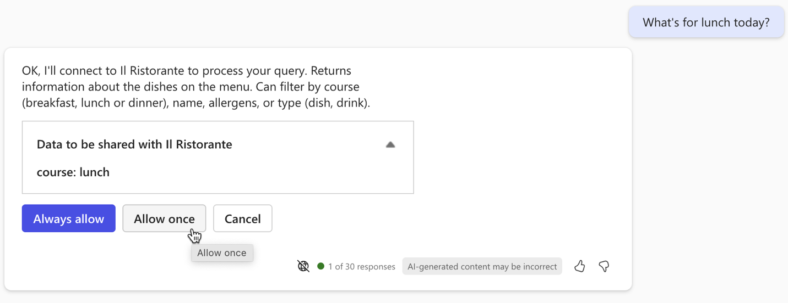
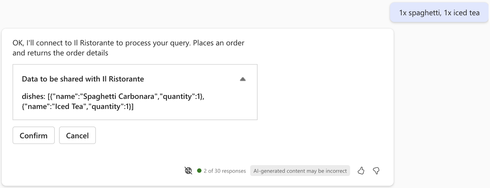

---
lab:
  title: 'Exercise 4 - Test the declarative agent with API plugin in Microsoft 365 Copilot'
  module: 'LAB 02: Build your first action for declarative agents with API plugin by using Visual Studio Code'
---

# Exercise 4 - Test the declarative agent with API plugin in Microsoft 365 Copilot

Extending a declarative agent with actions allows it to retrieve and update data stored in external systems in real-time. Using API plugins, you can connect to external systems through their APIs to retrieve and update information.

### Exercise Duration

- **Estimated Time to complete**: 10 minutes

## Task 1 - Test the declarative agent

The final step is to test the declarative agent with API plugin in Microsoft 365 Copilot.

In Visual Studio Code:

1. From the **Activity Bar**, choose **Teams Toolkit**.
1. In the **Accounts** section, ensure that you're signed in to your Microsoft 365 tenant with Microsoft 365 Copilot.

  

1. From the **Activity Bar**, choose **Run and Debug**.
1. Select the **Debug in Copilot** configuration and start debugging using the **Start Debugging** button.  

  

1. Visual Studio Code builds and deploys your project to your Microsoft 365 tenant and opens a new web browser window.

In the web browser:

1. When prompted, sign in with the account that belongs to your Microsoft 365 tenant with Microsoft 365 Copilot.
1. From the side bar, select **Il Ristorante**.

  

1. Choose the **What's for lunch today?** conversation starter and submit the prompt.

  

1. When prompted, examine the data that the agent sends to the API and confirm using the **Allow once** button.

  

1. Wait for the agent to respond. Notice that while it shows citations for the information it retrieves from the API, the popup only shows the dish's title. It doesn't show any additional information, because the API plugin doesn't define an Adaptive Card template.

  

1. Place an order, by typing in the prompt text box: **1x spaghetti, 1x iced tea** and submit the prompt.
1. Examine the data that the agent sends to the API and continue using the **Confirm** button.

  

1. Wait for the agent to place the order and return the order summary. Once again, notice that the agent shows the order summary in plain text because it doesn't have an Adaptive Card template.

  

1. Go back to Visual Studio Code and stop debugging.
1. Switch to the **Terminal** tab and close all active terminals.

  
