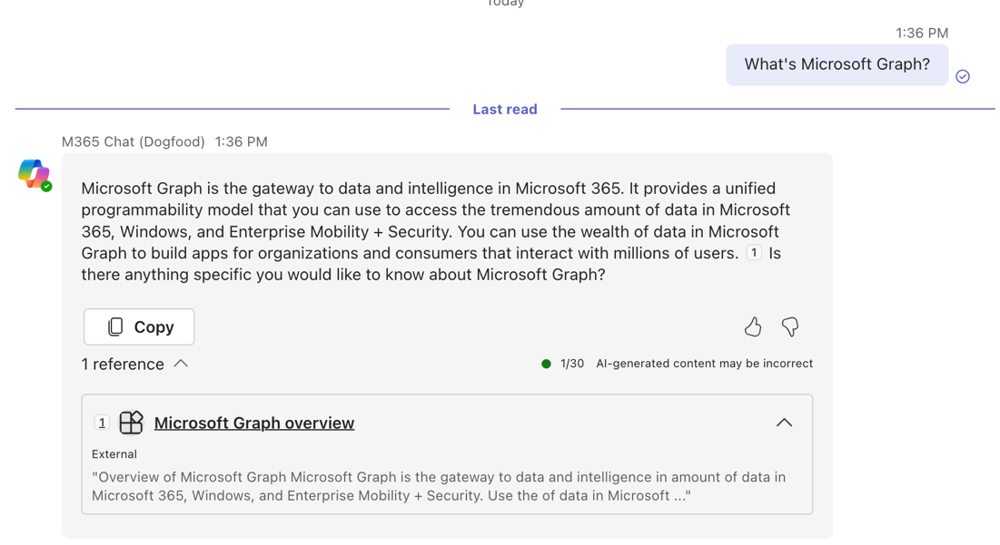
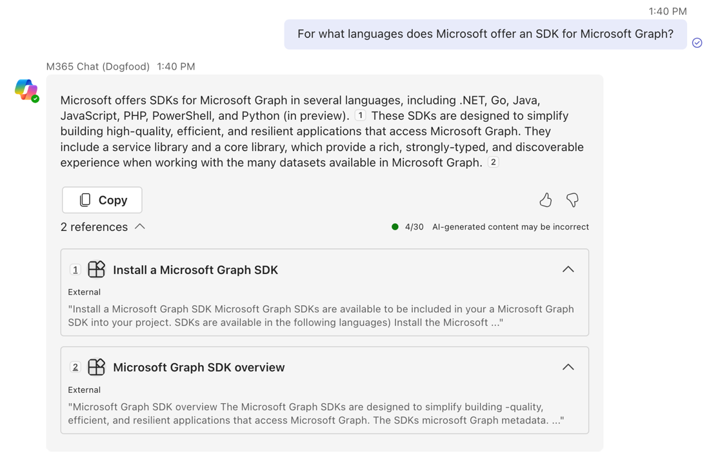

---
lab:
    title: 'Exercise 5 – Get answers based on external content in Copilot'
    module: 'LAB 02: Integrate external content with Copilot for Microsoft 365 using Microsoft Graph connectors built with .NET'
---

# Exercise 5 – Get answers based on external content in Copilot

In this exercise, you use Copilot for Microsoft 365 to get answers related to using Microsoft Graph. Copilot uses the external content you ingested as a reference to provide you with answers.

## Before you start

This exercise will take you about **XX minutes** to complete. You also need access to Copilot for Microsoft 365 to complete this exercise.

## Task 1 - Get answers from Copilot based on external content

In Microsoft Teams:

1. From the left rail, select **Copilot**
1. Start the conversation by asking: **What's Microsoft Graph**
1. Copilot responds with an answer. Notice, that the reply contains a reference to the external item you ingested previously.
   
1. Continue the conversation by asking a follow-up question: **For what languages does Microsoft offer an SDK for Microsoft Graph?**
   
1. Once again, notice that Copilot responds using the content you ingested in previous exercises.

[Continue to the lab summary...](./7-summary.md)