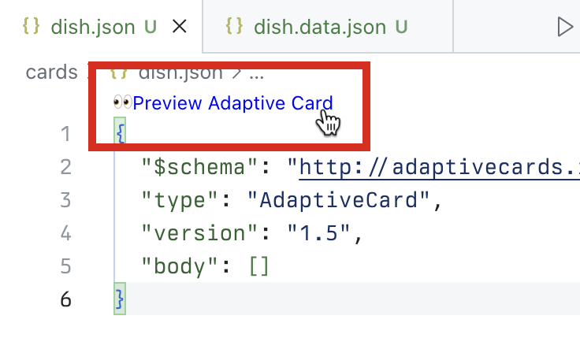
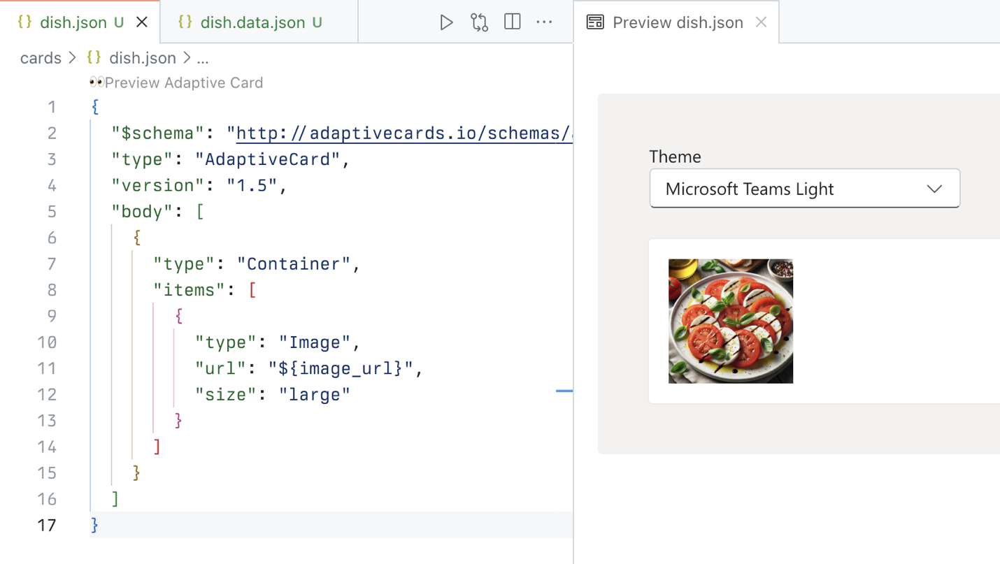
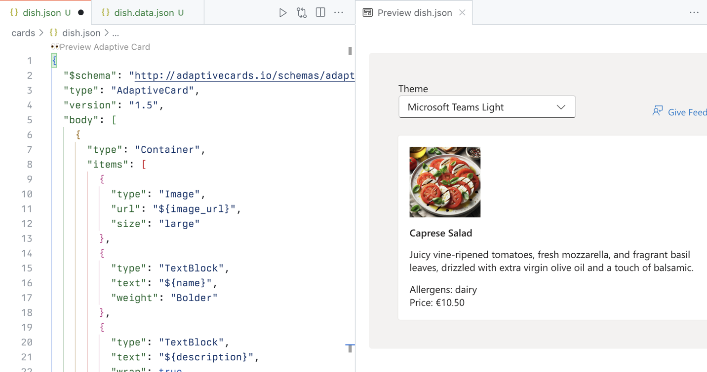
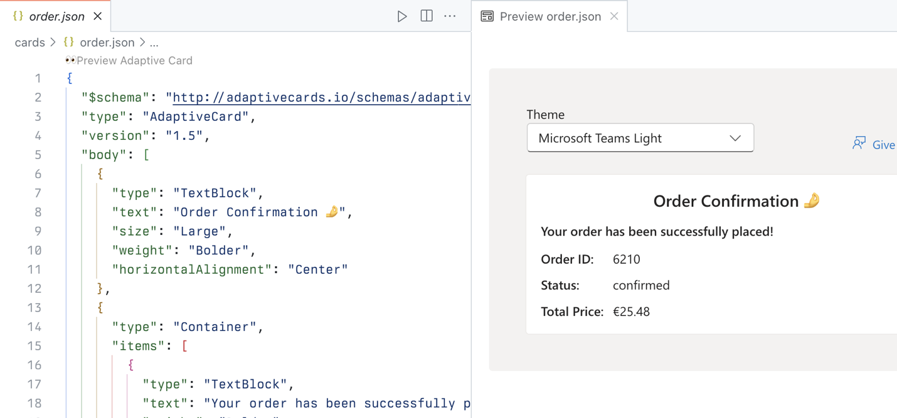
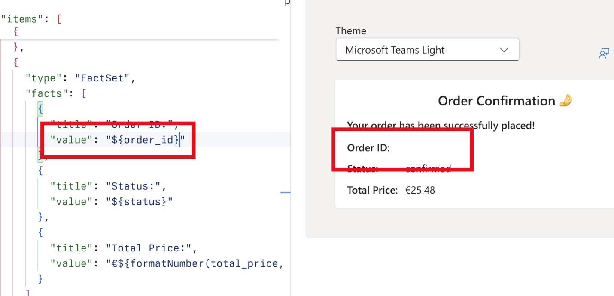

---
lab:
  title: 'Exercise 1 - Download project and build an adaptive card'
  module: 'LAB 03: Use Adaptive Cards to show data in API plugins for declarative agents'
---

# Exercise 1 - Download project and build an adaptive card

Let's start by building Adaptive Card templates for the agent to show the data in its responses. To build the Adaptive Card template, you use the Adaptive Card Previewer Visual Studio Code extensions to easily preview your work directly in Visual Studio Code. Using the extension allows us to build an Adaptive Card template, with references to data. At runtime, the agent fills the placeholder with data it retrieves from the API.

### Exercise Duration

- **Estimated Time to complete**: 10 minutes

## Task 1 - Download the starter project

Start by downloading the sample project. In a web browser:

1. Navigate to [https://github.com/microsoft/learn-declarative-agent-api-plugin-adaptive-cards-typescript](https://github.com/microsoft/learn-declarative-agent-api-plugin-adaptive-cards-typescript).
  1. Follow the steps to [download the repository source code](https://docs.github.com/repositories/working-with-files/using-files/downloading-source-code-archives#downloading-source-code-archives-from-the-repository-view) to your computer.
  1. Extract the contents of the downloaded ZIP file and extract it to your **Documents folder**.
  1. Open the folder in Visual Studio Code.

The sample project is a Teams Toolkit project that includes a declarative agent with an action built with an API plugin. The API plugin connects to an anonymous API running on Azure Functions also included in the project. The API belongs to a fictitious Italian restaurant and allows you to browse today's menu and place orders.

## Task 2 - Build an Adaptive Card for a dish

First, create an Adaptive Card that shows information about a single dish.

In Visual Studio Code:

1. In the **Explorer** view, create a new folder named **cards**.
1. In the **cards** folder, create a new file named **dish.json**. Paste the following contents that represent an empty Adaptive Card:

  ```json
  {
    "$schema": "http://adaptivecards.io/schemas/adaptive-card.json",
    "type": "AdaptiveCard",
    "version": "1.5",
    "body": []
  }
  ```

1. Before you continue, from the **Extensions** tab of the activity bar, search for and install the **Adaptive Card Previewer** extension and then create a data file for the Adaptive Card:
  1. Open the command palette by pressing <kbd>CTRL</kbd>+<kbd>P</kbd> on the keyboard. Type `>Adaptive` to find commands related to working with Adaptive Cards.

    

  1. From the list, choose **Adaptive Card: New Data File**. Visual Studio Code creates a new file named **dish.data.json**.
  1. Replace its contents with a data that represents a dish:

  ```json
  {
    "id": 4,
    "name": "Caprese Salad",
    "description": "Juicy vine-ripened tomatoes, fresh mozzarella, and fragrant basil leaves, drizzled with extra virgin olive oil and a touch of balsamic.",
    "image_url": "https://raw.githubusercontent.com/pnp/copilot-pro-dev-samples/main/samples/da-ristorante-api/assets/caprese_salad.jpeg",
    "price": 10.5,
    "allergens": [
    "dairy"
    ],
    "course": "lunch",
    "type": "dish"
  }
  ```

  1. Save your changes
1. Go back to the **dish.json** file.
1. From the lens, select **Preview Adaptive Card**.

  

  Visual Studio Code opens a preview of the card to the side. As you're editing the card, your changes are immediately visible on the side.

1. To the **body** array, add a **Container** element with a reference to the image URL stored in the **image_url** property.

  ```json
  {
    "type": "Container",
    "items": [
    {
      "type": "Image",
      "url": "${image_url}",
      "size": "large"
    }
    ]
  }
  ```

  Notice how the card preview automatically updates to show your card:

  

1. Add references to other dish properties. The complete card looks as follows:

  ```json
  {
    "$schema": "http://adaptivecards.io/schemas/adaptive-card.json",
    "type": "AdaptiveCard",
    "version": "1.5",
    "body": [
    {
      "type": "Container",
      "items": [
      {
        "type": "Image",
        "url": "${image_url}",
        "size": "large"
      },
      {
        "type": "TextBlock",
        "text": "${name}",
        "weight": "Bolder"
      },
      {
        "type": "TextBlock",
        "text": "${description}",
        "wrap": true
      },
      {
        "type": "TextBlock",
        "text": "Allergens: ${if(count(allergens) > 0, join(allergens, ', '), 'none')}",
        "weight": "Lighter"
      },
      {
        "type": "TextBlock",
        "text": "**Price:** €${formatNumber(price, 2)}",
        "weight": "Lighter",
        "spacing": "None"
      }
      ]
    }
    ]
  }
  ```

  

  Notice that to display allergens you use a function to join the allergens into a string. If a dish doesn't have allergens, you display **none**. To ensure that prices are properly formatted, you use the **formatNumber** function that allows us to specify the number of decimals to show on the card.

## Task 3 - Build an Adaptive Card for the order summary

The sample API allows users to browse the menu and place an order. Let's create an adaptive card that shows the order summary.

In Visual Studio Code:

1. In the **cards** folder, create a new file named **order.json**. Paste the following contents that represent an empty Adaptive Card:

  ```json
  {
    "$schema": "http://adaptivecards.io/schemas/adaptive-card.json",
    "type": "AdaptiveCard",
    "version": "1.5",
    "body": []
  }
  ```

1. Create a data file for the Adaptive Card:
  1. Open the command palette by pressing <kbd>CTRL</kbd>+<kbd>P</kbd> (<kbd>CMD</kbd>+<kbd>P</kbd> on macOS) on the keyboard. Type `>Adaptive` to find commands related to working with Adaptive Cards.

    

  1. From the list, choose **Adaptive Card: New Data File**. Visual Studio Code creates a new file named **order.data.json**.
  1. Replace its contents with a data that represents the order summary:

    ```json
    {
      "order_id": 6210,
      "status": "confirmed",
      "total_price": 25.48
    }
    ```

  1. Save your changes
1. Go back to the **order.json** file.
1. From the lens, select **Preview Adaptive Card**.
1. Next, replace the contents of the **order.json** file with the following code:

  ```json
  {
    "$schema": "http://adaptivecards.io/schemas/adaptive-card.json",
    "type": "AdaptiveCard",
    "version": "1.5",
    "body": [
    {
      "type": "TextBlock",
      "text": "Order Confirmation 🤌",
      "size": "Large",
      "weight": "Bolder",
      "horizontalAlignment": "Center"
    },
    {
      "type": "Container",
      "items": [
      {
        "type": "TextBlock",
        "text": "Your order has been successfully placed!",
        "weight": "Bolder",
        "spacing": "Small"
      },
      {
        "type": "FactSet",
        "facts": [
        {
          "title": "Order ID:",
          "value": "${order_id} "
        },
        {
          "title": "Status:",
          "value": "${status}"
        },
        {
          "title": "Total Price:",
          "value": "€${formatNumber(total_price, 2)}"
        }
        ]
      }
      ]
    }
    ]
  }
  ```

  Just like in the previous section, you map each element on the card to a data property.

  

  > [!IMPORTANT]
  > Notice the trailing space after **${order_id}**. This is intentional, because of a known issue with Adaptive Cards rendering numbers. To test it, remove the space and see that the number disappears from the preview.
  >
  > 

  Restore the trailing space so that your card shows properly and save your changes.