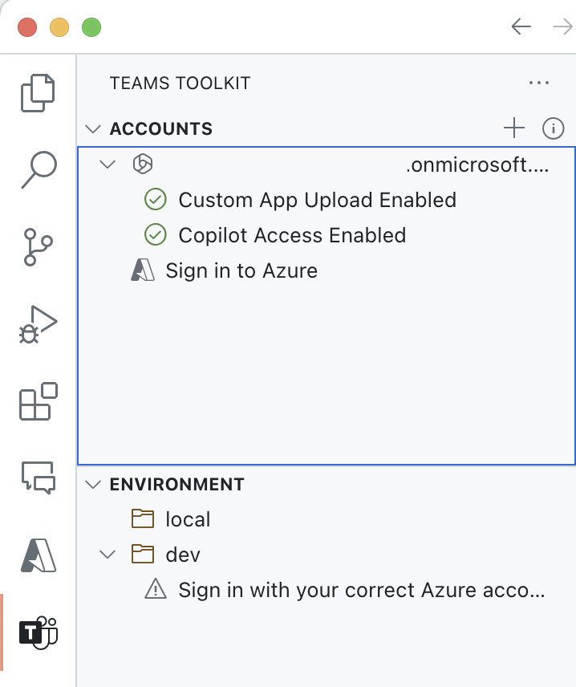
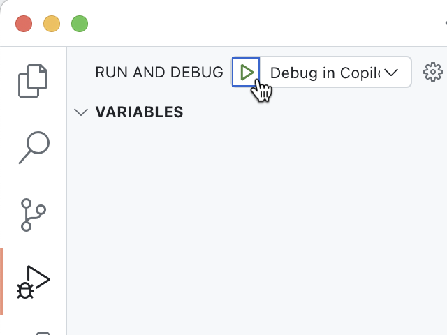
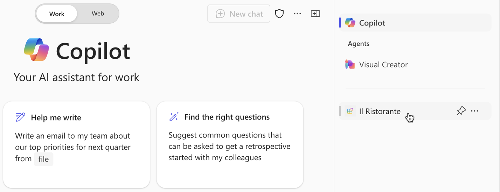
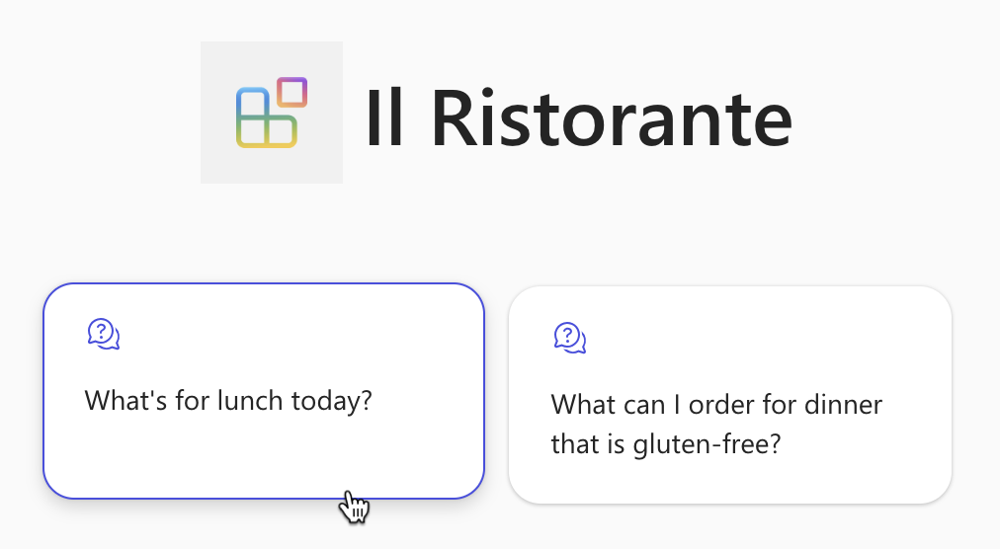
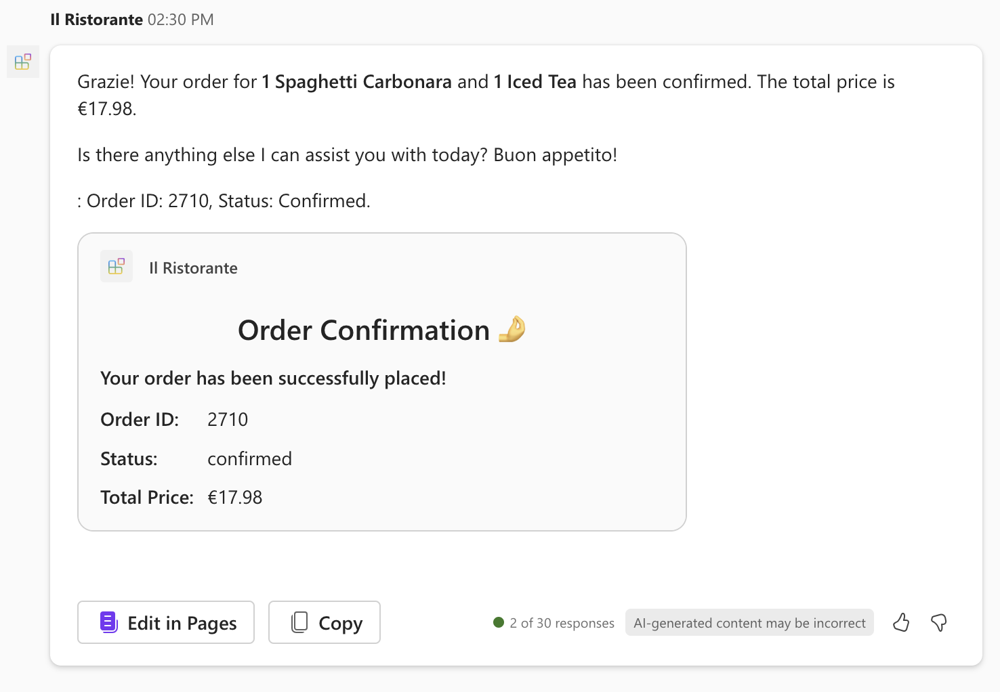
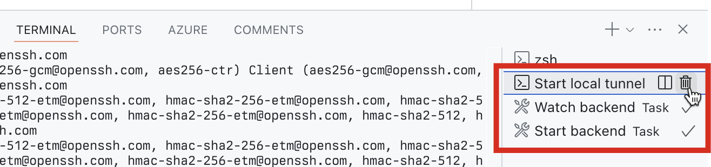

---
lab:
    title: 'Exercise 3 - Test the declarative agent with the API plugin in Microsoft 365 Copilot'
    module: 'LAB 03: Use Adaptive Cards to show data in API plugins for declarative agents'
---

# Exercise 3 - Test the declarative agent with the API plugin in Microsoft 365 Copilot

The final step is to test the declarative agent with API plugin in Microsoft 365 Copilot.

### Exercise Duration

- **Estimated Time to complete**: 10 minutes

## Task 1 - Provision and start debugging debug

In Visual Studio Code:

1. From the **Activity Bar**, choose **Teams Toolkit**.
1. In the **Accounts** section, ensure that you're signed in to your Microsoft 365 tenant with Microsoft 365 Copilot.

    

1. From the **Activity Bar**, choose **Run and Debug**.
1. Select the **Debug in Copilot** configuration and start debugging using the **Start Debugging** button.  

    

1. Visual Studio Code builds and deploys your project to your Microsoft 365 tenant and opens a new web browser window.

## Task 2 - Test and review results

In the web browser:

1. When prompted, sign in with the account that belongs to your Microsoft 365 tenant with Microsoft 365 Copilot.
1. From the side bar, select **Il Ristorante**.

    

1. Choose the **What's for lunch today?** conversation starter and submit the prompt.

    

1. When prompted, examine the data that the agent sends to the API and confirm using the **Allow once** button.

    

1. Wait for the agent to respond. Notice that the popup on a citation now includes your custom Adaptive Card with additional information from the API.

    

1. Place an order, by typing in the prompt text box: **1x spaghetti, 1x iced tea** and submit the prompt.
1. Examine the data that the agent sends to the API and continue using the **Confirm** button.

    

1. Wait for the agent to place the order and return the order summary. Notice, that because the API returns a single item, the agent renders it using an Adaptive Card and includes the card directly in its response.

    

1. Go back to Visual Studio Code and stop debugging.
1. Switch to the **Terminal** tab and close all active terminals.

    
