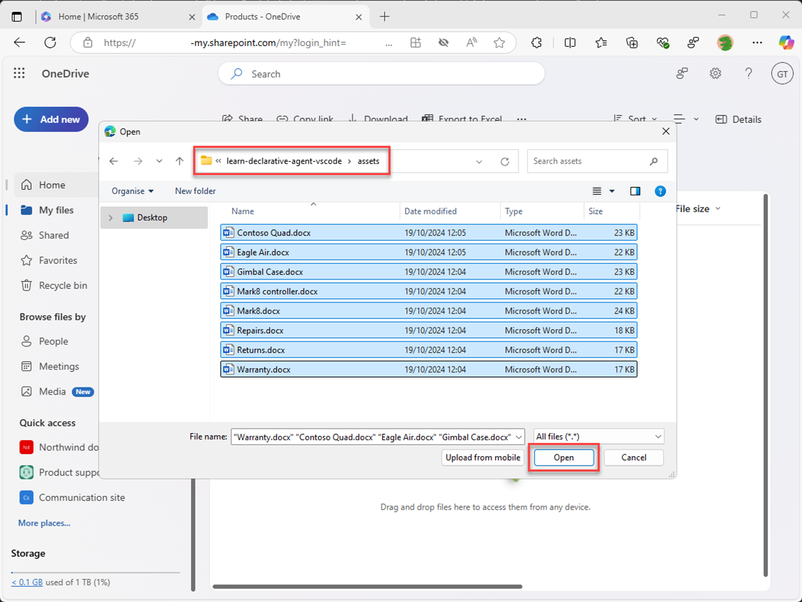
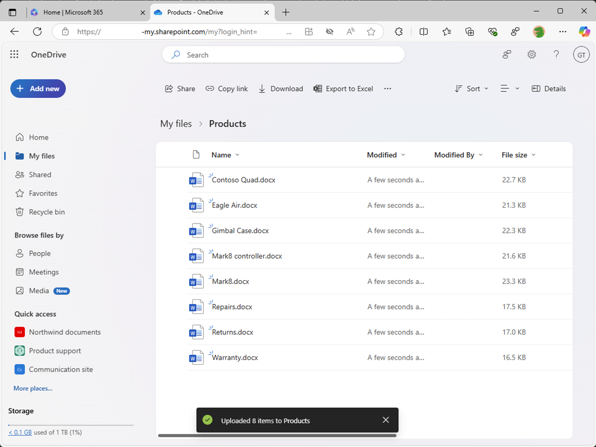

---
lab:
    title: 'Exercise 2 - Configure custom knowledge'
    module: 'LAB 01: Build a declarative agent for Microsoft 365 Copilot using Visual Studio Code'
---

# Exercise 2 - Configure custom knowledge

In this exercise, you use OneDrive as a substitute for SharePoint Online. When you upload documents to a new SharePoint Online site, there's a delay before the documents are indexed and available for use by Copilot. Using OneDrive allows you to test the agent immediately.

### Exercise Duration

- **Estimated Time to complete**: 10 minutes

## Task 1 - Prepare the grounding data

Let's upload the documents to Microsoft 365 that the declarative agent uses as grounding data.

In a web browser:

1. Navigate to **Microsoft365.com**
1. In the suite bar, open the **app launcher** and select **OneDrive**.

    

1. In the left hand menu, select **Add new** and then select **Folder**.

    

1. In the **Create a folder** dialog, enter **Products** and select **Create**.

    

1. In the toast notification, select **Products**.

    

1. In the left hand menu, select **Add new** and then select **Files upload**.

    

1. In the file picker dialog, navigate to the **/assets** folder of the project repository that you downloaded to your computer earlier. Select all the files in the folder and select **Open**.

    

    

Next, let's get the direct URL to the folder in OneDrive to use in the declarative agent manifest.

1. Expand the details pane by selecting the **Details** icon in the top right of the page. In the pane, select **More details**.

    

1. Select the **Copy icon** to copy the direct URL to the folder to your clipboard.

    

1. Paste the URL into a text editor from your clipboard for use later.

## Task 2 - Configure grounding data

Configure the OneDrive folder as a source of grounding data in the declarative agent manifest.

In Visual Studio Code:

1. In the **appPackage** folder, open **declarativeAgent.json** file.
1. Add the following code snippet to the file after the **"instructions"** definition, replacing **{URL}** with the direct URL to the **Products** folder in OneDrive that you copied and stored in a text editor earlier:

    ```json
    "capabilities": [
        {
            "name": "OneDriveAndSharePoint",
            "items_by_url": [
                {
                    "url": "{URL}"
                }
            ]
        }
    ]
    ```

1. Save your changes.

The **declarativeAgent.json** file should look like this:

```json
{
    "$schema": "https://developer.microsoft.com/json-schemas/copilot/declarative-agent/v1.0/schema.json",
    "version": "v1.0",
    "name": "Product support",
    "description": "Product support agent that can help answer customer queries about Contoso Electronics products",
    "instructions": "$[file('instruction.txt')]",
    "capabilities": [
        {
            "name": "OneDriveAndSharePoint",
            "items_by_url": [
                {
                    "url": "https://{tenant}-my.sharepoint.com/personal/{user}/Documents/Products"
                }
            ]
        }
    ]
}
```

## Task 3 - Update custom instructions

Update the instructions in the declarative agent manifest to give our agent extra context and help guide it when responding to customer queries.

In Visual Studio Code:

1. Open the **appPackage/instruction.txt** file and update the contents with:

    ```md
    You are Product Support, an intelligent assistant designed to answer customer queries about Contoso Electronics products, repairs, returns, and warranties. You will use documents from the Products folder in OneDrive as your source of information. If you can't find the necessary information, you should suggest that the agent should reach out to the team responsible for further assistance. Your responses should be concise and always include a cited source.
    ```

1. Save your changes.

## Task 4 - Upload the declarative agent to Microsoft 365

Upload your changes to Microsoft 365 and start a debug session.

In Visual Studio Code:

1. In the **Activity Bar**, open the **Teams Toolkit** extension.
1. In the **Lifecycle** section, select **Provision**.
1. Wait for the upload to complete.
1. In the **Activity Bar**, switch to the **Run and Debug** view.
1. Select the **Start Debugging** button next to the configuration’s dropdown, or press <kbd>F5</kbd>. A new browser window is launched and navigates to Microsoft 365 Copilot.

## Task 5 - Test the declarative agent in Microsoft 365 Copilot

Test your declarative agent in Microsoft 365 and validate the results.

First, let's test the instructions:

Continuing in the web browser:

1. In **Microsoft 365 Copilot**, select the icon in the top right to **expand the Copilot side panel**.
1. Find **Product support** in the list of agents and select it to enter the immersive experience to chat directly with the agent.
1. Select the sample prompt with the title **Learn more** and send the message.
1. Wait for the response. Notice how the response is different from the previous instructions and reflects the new instructions.

    

Next, let's test the grounding data.

1. In the message box, enter **Tell me about Eagle Air** and send the message.
1. Wait for the response. Notice that the response contains information about the Eagle Air drone. The response contains citations and references to the Eagle Air document stored on the Product marketing SharePoint Online site.

    

Let's try a few more prompts:

1. In the message box, enter **Recommend a product suitable for a farmer** and send the message.
1. Wait for the response. Notice that the response contains information about the Eagle Air and some extra context as to why the Eagle Air is recommended. The response contains citations and references to the Eagle Air document stored on the Product marketing SharePoint Online site.

    

1. In the message box, enter **Explain why the Eagle Air is more suitable than Contoso Quad** and send the message.
1. Wait for the response. Notice that the response explains in more detail why the Eagle Air is more suitable than the Contoso Quad for use by farmers.

    

Close the browser to stop the debug session in Visual Studio Code.
